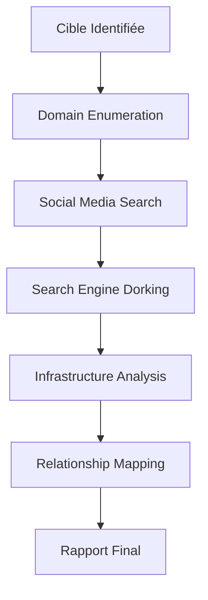

# 🔍 Reconnaissance - Information Gathering

<div align="center">


*Outils et techniques pour la collecte d'informations initiale*

</div>

---

## 📋 Contenu du Dossier

### 🌐 **Domain Enumeration**
- **Maltego** - Visualisation des relations et connexions
- **SpiderFoot** - Reconnaissance automatisée multi-sources
- **Shodan** - Moteur de recherche pour appareils connectés
- **Censys** - Analyse d'infrastructure Internet

### 📱 **Social Media Intelligence**
- **Sherlock** - Recherche de noms d'utilisateur
- **Social Links** - Investigation réseaux sociaux
- **Twitonomy** - Analyse Twitter avancée
- **Crowdtangle** - Surveillance médias sociaux

### 🔎 **Search Engines**
- **Google Dorking** - Recherche avancée Google
- **Yandex** - Moteur de recherche russe
- **Bing** - Recherche Microsoft
- **DuckDuckGo** - Recherche privée

---

## 🎯 Cas d'Usage

### 🏢 **Reconnaissance d'Entreprise**
1. Énumération de domaines et sous-domaines
2. Identification des employés sur LinkedIn
3. Analyse de l'infrastructure IT
4. Cartographie des relations

### 👤 **Investigation Personnelle**
1. Recherche de profils sur réseaux sociaux
2. Vérification d'identité
3. Analyse des connexions
4. Historique numérique

---

## 🚀 Workflow Recommandé



---

## ⚡ Quick Commands

```bash
# Énumération de base
whois target.com
nslookup target.com
dig target.com

# Recherche sous-domaines
subfinder -d target.com
amass enum -d target.com

# Analyse Shodan
shodan search "target.com"
```

---

## 📚 Ressources

- 🎓 **[OSINT Techniques](https://inteltechniques.com/)** - Méthodes avancées
- 📖 **[Reconnaissance Guide](https://owasp.org/www-project-web-security-testing-guide/)** - OWASP Guide
- 🔧 **[Recon-ng](https://github.com/lanmaster53/recon-ng)** - Framework reconnaissance

---

<div align="center">

*Explorez les sous-dossiers pour des guides détaillés de chaque outil !*

</div>