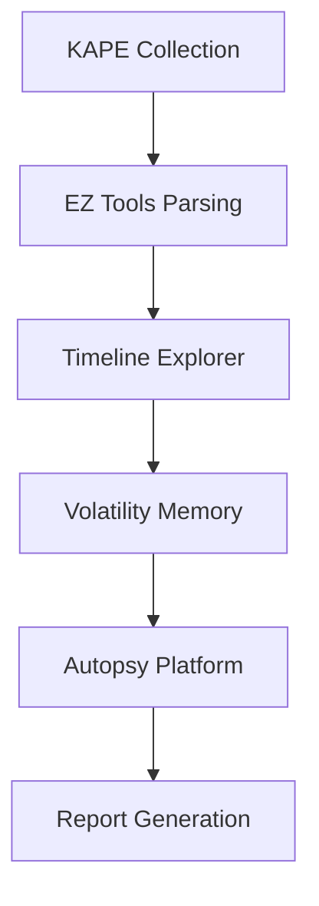

# 🛠️ Tools - Outils Forensiques Spécialisés

<div align="center">


*Collection complète d'outils forensiques par catégorie*

</div>

---

## 📋 Contenu du Dossier

### ⚡ **Zimmerman Tools (EZ Tools)**
- **Timeline Explorer** - Visualisation de timeline
- **Registry Explorer** - Analyse de registre
- **AmcacheParser** - Analyse Amcache
- **EvtxECmd** - Parsing Event Logs
- **RECmd** - Registry parsing en batch
- **JLECmd** - Jump Lists analysis

### 🔍 **Autopsy Platform**
- **Installation & Setup** - Configuration
- **Case Management** - Gestion d'affaires
- **Module Development** - Développement modules
- **Reporting** - Génération de rapports

### 💰 **Commercial Tools**
- **EnCase** - Guidance Software
- **FTK** - AccessData Forensic Toolkit
- **X-Ways** - X-Ways Forensics
- **Cellebrite** - Mobile forensics

### 🆓 **Open Source Tools**
- **Sleuth Kit** - File system analysis
- **Volatility** - Memory forensics
- **Wireshark** - Network analysis
- **YARA** - Malware identification

---

## ⚡ Zimmerman Tools - Guide Complet

### 📥 **Installation**
```powershell
# Téléchargement automatique
wget https://f001.backblazeb2.com/file/EricZimmermanTools/Get-ZimmermanTools.zip

# Ou utiliser le script PowerShell
.\Get-ZimmermanTools.ps1 -Dest C:\EZTools
```

### 🎯 **Outils Essentiels**

#### 📊 **Timeline Explorer**
```bash
# Lancement
TimelineExplorer.exe

# Ouvrir CSV KAPE
File > Open CSV Files > Select KAPE output

# Filtres utiles
- Date range filtering
- File extension filtering
- Keyword searching
- Column sorting
```

#### 🗂️ **Registry Explorer**
```bash
# Analyse registry hive
RegistryExplorer.exe --f SYSTEM

# Navigation par bookmarks
- User Assist entries
- Run keys
- Services
- Network configuration
```

#### 📝 **AmcacheParser**
```bash
# Parser Amcache.hve
AmcacheParser.exe -f C:\Windows\AppCompat\Programs\Amcache.hve --csv C:\Output

# Avec timestamps
AmcacheParser.exe -f Amcache.hve --csv C:\Output --dt "yyyy-MM-dd HH:mm:ss"
```

#### 📋 **EvtxECmd**
```bash
# Parser event logs
EvtxECmd.exe -d C:\Windows\System32\winevt\Logs --csv C:\Output

# Avec maps spécifiques
EvtxECmd.exe -f Security.evtx --csv C:\Output --maps C:\EZTools\Maps
```

---

## 🔍 Autopsy - Platform Analysis

### 🚀 **Setup & Configuration**
```
1. Download Autopsy from sleuthkit.org
2. Install with default options
3. Configure case directory
4. Set up ingest modules
5. Configure central repository (optional)
```

### 📁 **Case Creation**
```
1. File > New Case
2. Enter case information
3. Add data source (disk image, directory)
4. Select ingest modules
5. Start analysis
```

### 🔧 **Key Modules**
| Module | Function | Output |
|--------|----------|--------|
| File Type Identification | Identify file types | File categories |
| Keyword Search | Text searching | Keyword hits |
| Hash Lookup | Known file detection | Hash matches |
| Web Artifacts | Browser analysis | Web history |
| Email Parser | Email analysis | Email messages |
| Android Analyzer | Mobile artifacts | Mobile data |

---

## 💰 Commercial Tools Overview

### 🏢 **EnCase**
- **Strengths**: Court-accepted, comprehensive
- **Use Cases**: Law enforcement, litigation
- **Cost**: High ($$$$)
- **Learning Curve**: Steep

### 🧰 **FTK (Forensic Toolkit)**
- **Strengths**: Fast processing, good UI
- **Use Cases**: Corporate investigations
- **Cost**: High ($$$$)
- **Learning Curve**: Moderate

### ⚡ **X-Ways Forensics**
- **Strengths**: Fast, comprehensive, affordable
- **Use Cases**: Professional investigators
- **Cost**: Moderate ($$$)
- **Learning Curve**: Steep

---

## 🆓 Open Source Alternatives

### 🔍 **The Sleuth Kit (TSK)**
```bash
# File system analysis
fls -r disk_image.dd

# File recovery
icat disk_image.dd inode_number > recovered_file

# Timeline creation
fls -m C: -r disk_image.dd > timeline.bodyfile
mactime -b timeline.bodyfile > timeline.csv
```

### 🧠 **Volatility**
```bash
# Memory analysis
volatility -f memory.raw --profile=Win10x64 pslist
volatility -f memory.raw --profile=Win10x64 filescan
volatility -f memory.raw --profile=Win10x64 netscan
```

### 🔬 **YARA**
```bash
# Malware detection
yara rules.yar /path/to/scan/

# Scan memory dump
yara rules.yar memory.raw

# Example rule
rule Suspicious_PE {
    meta:
        description = "Detects suspicious PE files"
    strings:
        $mz = "MZ"
        $pe = "PE"
    condition:
        $mz at 0 and $pe
}
```

---

## 📊 Tool Comparison Matrix

### 🎯 **By Use Case**
| Use Case | Best Tool | Alternative | Open Source |
|----------|-----------|-------------|-------------|
| Windows Registry | Registry Explorer | RegRipper | Registry Decoder |
| Memory Analysis | Volatility | Rekall | MemProcFS |
| Timeline Analysis | Timeline Explorer | Plaso | Timesketch |
| Disk Imaging | FTK Imager | EnCase | DD/Guymager |
| Network Analysis | Wireshark | NetworkMiner | TCPDump |
| Mobile Forensics | Cellebrite | Oxygen | ALEAPP |

### 💰 **By Budget**
| Budget | Recommended Stack |
|--------|-------------------|
| Free | Autopsy + Volatility + Wireshark + EZ Tools |
| Low ($) | X-Ways + EZ Tools + Volatility |
| Medium ($$) | FTK + Specialized modules |
| High ($$$) | EnCase + Cellebrite + Commercial add-ons |

---

## 🚀 Workflow Integration

### 🔄 **Tool Chain Example**


### ⚡ **Automated Workflow**
```powershell
# PowerShell automation script

# 1. KAPE Collection
& "C:\KAPE\kape.exe" --tsource C: --tdest "C:\Cases\$CaseName\Collection" --target !SANS_Triage

# 2. EZ Tools parsing
& "C:\EZTools\EvtxECmd.exe" -d "C:\Cases\$CaseName\Collection" --csv "C:\Cases\$CaseName\Parsed"
& "C:\EZTools\AmcacheParser.exe" -f "C:\Cases\$CaseName\Collection\Amcache.hve" --csv "C:\Cases\$CaseName\Parsed"

# 3. Timeline creation
& "C:\EZTools\TimelineExplorer.exe" "C:\Cases\$CaseName\Parsed\*.csv"
```

---

## 🔧 Tool Maintenance

### 🔄 **Updates**
```bash
# EZ Tools update
.\Get-ZimmermanTools.ps1 -Dest C:\EZTools

# Volatility update
pip install --upgrade volatility3

# Autopsy update
# Check sleuthkit.org for latest version
```

### 📋 **Licensing Tracking**
| Tool | License Type | Renewal | Cost |
|------|-------------|---------|------|
| EnCase | Annual | 12 months | $$$$ |
| FTK | Perpetual | Updates | $$$ |
| X-Ways | Perpetual | Optional | $$ |
| EZ Tools | Free | N/A | Free |

---

## 📚 Learning Resources

- 🎓 **[SANS FOR500](https://www.sans.org/cyber-security-courses/windows-forensic-analysis/)** - Windows Forensics
- 📖 **[Eric Zimmerman Blog](https://binaryforay.blogspot.com/)** - EZ Tools updates
- 🔧 **[Autopsy Training](https://www.sleuthkit.org/autopsy/training.php)** - Official training
- 📋 **[DFIR Training](https://www.dfir.training/)** - Community platform

---

<div align="center">

*🛠️ Le bon outil fait toute la différence dans l'investigation !*

</div>