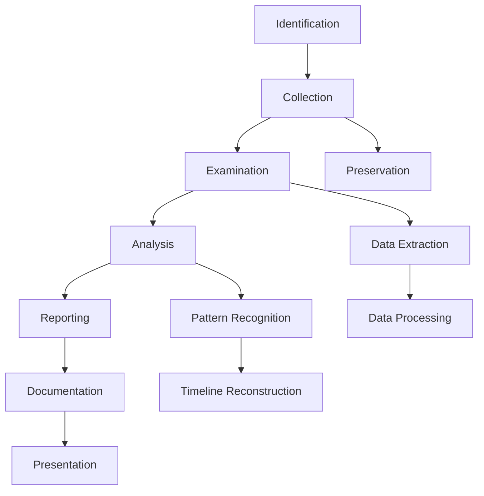

# 📚 Resources - Ressources DFIR

<div align="center">


*Collection complète de ressources pour l'investigation numérique*

</div>

---

## 📋 Contenu du Dossier

### 📄 **Cheatsheets**
- **Windows Artifacts** - Localisation des artefacts
- **Registry Keys** - Clés de registre importantes
- **Event IDs** - IDs d'événements critiques
- **Volatility Commands** - Commandes mémoire
- **KAPE Targets** - Targets de collection

### 🎯 **Case Studies**
- **APT Investigations** - Cas d'attaques avancées
- **Ransomware Analysis** - Analyses de ransomware
- **Insider Threats** - Menaces internes
- **Mobile Forensics** - Cas mobiles

### 📖 **Documentation**
- **DFIR Methodologies** - Méthodologies standard
- **Legal Guidelines** - Aspects juridiques
- **Chain of Custody** - Chaîne de possession
- **Report Templates** - Modèles de rapports

### 📋 **Templates**
- **Investigation Reports** - Rapports d'investigation
- **Timeline Templates** - Modèles de timeline
- **Incident Response** - Réponse aux incidents
- **Evidence Forms** - Formulaires de preuves

---

## 📄 Cheatsheets Essentiels

### 🪟 **Windows Artifacts Locations**
```
📁 Registry Hives
├── SYSTEM     → C:\Windows\System32\config\SYSTEM
├── SOFTWARE   → C:\Windows\System32\config\SOFTWARE
├── SAM        → C:\Windows\System32\config\SAM
├── SECURITY   → C:\Windows\System32\config\SECURITY
└── NTUSER.DAT → C:\Users\%USERNAME%\NTUSER.DAT

📁 Event Logs
├── Security   → C:\Windows\System32\winevt\Logs\Security.evtx
├── System     → C:\Windows\System32\winevt\Logs\System.evtx
└── Application→ C:\Windows\System32\winevt\Logs\Application.evtx

📁 User Artifacts
├── Recent     → C:\Users\%USERNAME%\AppData\Roaming\Microsoft\Windows\Recent
├── Jump Lists → C:\Users\%USERNAME%\AppData\Roaming\Microsoft\Windows\Recent\AutomaticDestinations
└── Prefetch   → C:\Windows\Prefetch\*.pf
```

### 🔑 **Critical Registry Keys**
```
🚀 Autostart Locations
HKLM\SOFTWARE\Microsoft\Windows\CurrentVersion\Run
HKCU\SOFTWARE\Microsoft\Windows\CurrentVersion\Run
HKLM\SOFTWARE\Microsoft\Windows\CurrentVersion\Services

🌐 Network Configuration
HKLM\SYSTEM\CurrentControlSet\Services\Tcpip\Parameters\Interfaces
HKLM\SOFTWARE\Microsoft\Windows NT\CurrentVersion\NetworkList

👤 User Activity
HKCU\SOFTWARE\Microsoft\Windows\CurrentVersion\Explorer\RecentDocs
HKCU\SOFTWARE\Microsoft\Windows\CurrentVersion\Explorer\UserAssist
```

### 📊 **Critical Event IDs**
```
🔐 Authentication Events
4624 - Successful logon
4625 - Failed logon
4634 - Account logged off
4648 - Logon with explicit credentials
4672 - Special privileges assigned

⚡ System Events
7045 - Service installation
4688 - Process creation
4689 - Process termination
1074 - System shutdown/restart

🛡️ Security Events
4698 - Scheduled task created
4699 - Scheduled task deleted
4702 - Scheduled task updated
5140 - Network share accessed
```

---

## 🎯 Investigation Methodologies

### 🔍 **NIST Forensic Process**


### 📋 **Investigation Phases**

#### 1️⃣ **Preparation**
- [ ] Legal authorization obtained
- [ ] Tools prepared and tested
- [ ] Documentation templates ready
- [ ] Chain of custody forms
- [ ] Secure storage prepared

#### 2️⃣ **Identification**
- [ ] Evidence sources identified
- [ ] Volatile data prioritized
- [ ] Scope of investigation defined
- [ ] Stakeholders notified

#### 3️⃣ **Preservation**
- [ ] System isolation (if needed)
- [ ] Memory capture
- [ ] Disk imaging
- [ ] Hash verification
- [ ] Chain of custody maintained

#### 4️⃣ **Collection**
- [ ] Live data collection (KAPE)
- [ ] System artifacts gathered
- [ ] Network logs collected
- [ ] Documentation maintained

#### 5️⃣ **Examination**
- [ ] Data parsing and processing
- [ ] Artifact extraction
- [ ] Timeline creation
- [ ] Initial triage

#### 6️⃣ **Analysis**
- [ ] Timeline analysis
- [ ] Correlation of events
- [ ] Hypothesis testing
- [ ] IOC identification

#### 7️⃣ **Presentation**
- [ ] Report writing
- [ ] Executive summary
- [ ] Technical details
- [ ] Recommendations

---

## 📊 Case Study Templates

### 🦠 **Malware Investigation Template**
```markdown
# Malware Investigation Report

## Executive Summary
- **Incident Date**: [Date]
- **Detection Method**: [How detected]
- **Impact**: [Systems affected]
- **Status**: [Contained/Eradicated/Monitoring]

## Technical Analysis
### Initial Compromise
- **Vector**: [Email/USB/Network/Unknown]
- **File Hash**: [SHA256]
- **File Name**: [Original name]
- **Timestamp**: [First seen]

### Malware Behavior
- **Persistence**: [Registry/Service/Task]
- **Network Activity**: [C2 servers]
- **File Operations**: [Created/Modified/Deleted]
- **Process Activity**: [Spawned processes]

### Timeline of Events
| Time | Event | Source |
|------|-------|--------|
| [Time] | [Event description] | [Log source] |

### Indicators of Compromise
- **File Hashes**: [List of SHA256]
- **IP Addresses**: [C2 IPs]
- **Domain Names**: [Malicious domains]
- **Registry Keys**: [Persistence keys]

## Containment Actions
- [ ] Infected systems isolated
- [ ] Malware samples collected
- [ ] IOCs distributed
- [ ] Network rules updated

## Eradication Steps
- [ ] Malware removed
- [ ] Systems rebuilt
- [ ] Patches applied
- [ ] Security controls updated

## Recovery Actions
- [ ] Systems restored
- [ ] Data integrity verified
- [ ] Monitoring enhanced
- [ ] User training conducted

## Lessons Learned
- **What worked well**:
- **Areas for improvement**:
- **Recommendations**:
```

### 👤 **Insider Threat Template**
```markdown
# Insider Threat Investigation

## Case Information
- **Subject**: [Employee name/ID]
- **Department**: [Department]
- **Access Level**: [Privileges]
- **Investigation Period**: [Date range]

## Allegations
- **Type**: [Data theft/Sabotage/Policy violation]
- **Reporter**: [How reported]
- **Initial Evidence**: [What triggered investigation]

## Digital Evidence Analysis
### User Activity Timeline
| Date/Time | Activity | System | Evidence |
|-----------|----------|--------|---------|
| [Timestamp] | [Activity] | [Computer] | [Log source] |

### Data Access Patterns
- **Normal Pattern**: [Baseline behavior]
- **Anomalous Activity**: [Suspicious behavior]
- **Files Accessed**: [Sensitive files touched]
- **Data Movement**: [USB/Email/Cloud]

### Communication Analysis
- **Email Activity**: [Internal/External communications]
- **Chat Logs**: [IM/Slack conversations]
- **Web Activity**: [Job sites/Competitors]

## Conclusions
- **Evidence Quality**: [Strong/Moderate/Weak]
- **Policy Violations**: [Specific violations]
- **Criminal Activity**: [Yes/No/Possible]
- **Recommendations**: [HR actions/Legal referral]
```

---

## 📋 Quick Reference Cards

### ⚡ **KAPE Quick Commands**
```bash
# Basic triage
kape.exe --tsource C: --tdest Output --target !BasicCollection

# Full SANS collection
kape.exe --tsource C: --tdest Output --target !SANS_Triage

# Malware focused
kape.exe --tsource C: --tdest Output --target !Malware

# With parsing
kape.exe --tsource C: --tdest Collect --target !BasicCollection --mdest Parsed --module !EZParser
```

### 🧠 **Volatility Quick Commands**
```bash
# Profile detection
volatility -f memory.raw imageinfo

# Process analysis
volatility -f memory.raw --profile=PROFILE pslist
volatility -f memory.raw --profile=PROFILE pstree

# Network connections
volatility -f memory.raw --profile=PROFILE netscan

# Malware hunting
volatility -f memory.raw --profile=PROFILE malfind
```

### 📊 **Timeline Explorer Filters**
```
# Date range
Short Date >= 2024-01-01 AND Short Date <= 2024-01-31

# File extensions
Full Path contains ".exe" OR Full Path contains ".dll"

# Suspicious activity
Full Path contains "temp" OR Full Path contains "appdata"

# User activity
Full Path contains "C:\Users\" AND NOT Full Path contains "AppData"
```

---

## 📚 Learning Resources

### 🎓 **Certifications**
- **GCFA** - GIAC Certified Forensic Analyst
- **GCFE** - GIAC Certified Forensic Examiner
- **GNFA** - GIAC Network Forensic Analyst
- **EnCE** - EnCase Certified Examiner
- **CCE** - Certified Computer Examiner

### 📖 **Books**
- **"Windows Forensic Analysis"** - Harlan Carvey
- **"The Art of Memory Forensics"** - Ligh, Case, Levy, Walters
- **"Digital Forensics with Open Source Tools"** - Cory Altheide
- **"Practical Malware Analysis"** - Sikorski & Honig

### 🌐 **Online Resources**
- **[DFIR Review](https://dfir.blog/)** - Community blog
- **[13Cubed](https://www.youtube.com/channel/UCy8ntxFEudOCRZYT1f7ya9Q)** - DFIR YouTube
- **[SANS DFIR](https://www.sans.org/blog/?focus-area=digital-forensics)** - SANS blog
- **[Volatility Labs](https://volatility-labs.blogspot.com/)** - Memory forensics

### 🔧 **Practice Platforms**
- **[DFIR Madness](https://dfirmadness.com/)** - CTF challenges
- **[Digital Corpora](https://digitalcorpora.org/)** - Practice images
- **[Honeynet Challenges](https://old.honeynet.org/challenges/)** - Forensic challenges
- **[CyberDefenders](https://cyberdefenders.org/)** - Blue team challenges

---

## 🏆 Best Practices

### ✅ **Investigation Do's**
- Document everything
- Maintain chain of custody
- Use forensically sound methods
- Verify tool accuracy
- Keep detailed notes
- Preserve original evidence

### ❌ **Investigation Don'ts**
- Don't work on original evidence
- Don't use untested tools
- Don't skip documentation
- Don't ignore legal requirements
- Don't rush the analysis
- Don't make unsupported conclusions

---

<div align="center">

*📚 La connaissance est la clé de l'investigation réussie !*

</div>