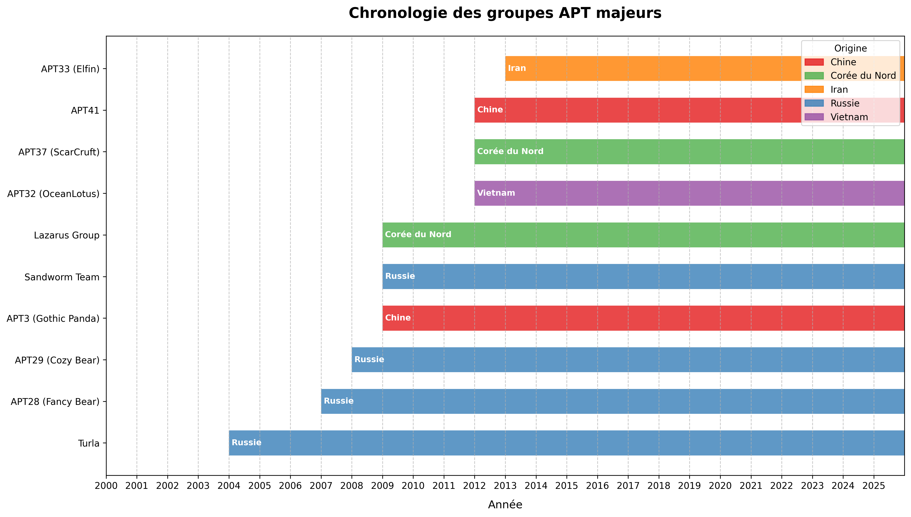
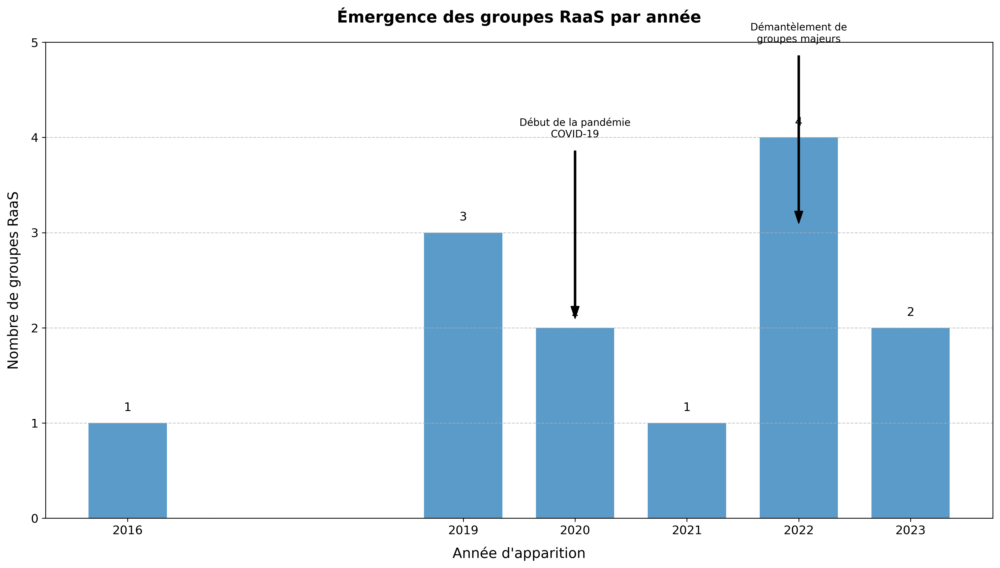
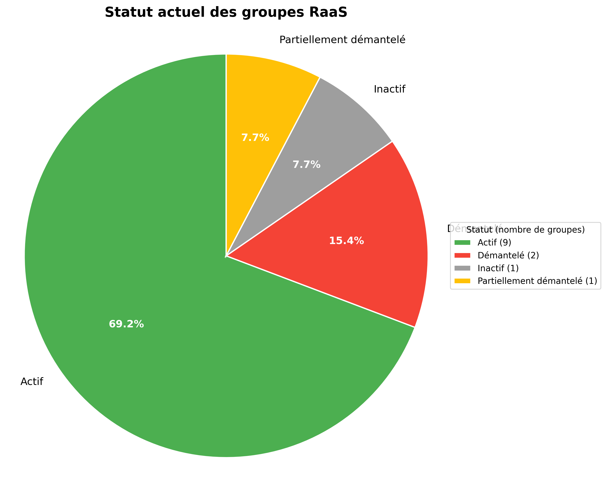

# Groupes APT et RaaS : Guide Complet et Interactif

Une analyse détaillée des groupes de menaces persistantes avancées (APT) et des services de ransomware (RaaS)

---

## Table des matières

- [Introduction](#introduction)
- [Vue d'ensemble des groupes APT](#vue-densemble-des-groupes-apt)
  - [Définition et caractéristiques](#définition-et-caractéristiques)
  - [Chronologie des groupes APT](#chronologie-des-groupes-apt)
  - [Origines géographiques](#origines-géographiques)
- [Vue d'ensemble des groupes RaaS](#vue-densemble-des-groupes-raas)
  - [Définition et modèle opérationnel](#définition-et-modèle-opérationnel)
  - [Émergence et évolution](#émergence-et-évolution)
  - [Statut actuel des groupes](#statut-actuel-des-groupes)
- [Techniques d'attaque](#techniques-dattaque)
  - [Techniques utilisées par les APT](#techniques-utilisées-par-les-apt)
  - [Techniques utilisées par les RaaS](#techniques-utilisées-par-les-raas)
  - [Évolution des techniques](#évolution-des-techniques)
- [Cibles et victimes](#cibles-et-victimes)
- [Profils détaillés des groupes](#profils-détaillés-des-groupes)
  - [Profils des groupes APT](#profils-des-groupes-apt)
  - [Profils des groupes RaaS](#profils-des-groupes-raas)
- [Stratégies de défense](#stratégies-de-défense)
- [Tendances futures](#tendances-futures)
- [Conclusion](#conclusion)
- [Références](#références)

---

## Introduction

Le paysage des cybermenaces évolue constamment, avec l'émergence de groupes de plus en plus sophistiqués et organisés. Parmi ces acteurs malveillants, deux catégories se distinguent particulièrement par leur impact et leur niveau de sophistication : les groupes APT (Advanced Persistent Threat) et les opérateurs de RaaS (Ransomware as a Service).

Ce document interactif et graphique vise à fournir une analyse complète et éducative de ces groupes, de leurs techniques d'attaque, de leurs cibles et de leur évolution au fil du temps. Il s'adresse aux professionnels de la cybersécurité, aux décideurs et à toute personne souhaitant comprendre les menaces actuelles dans le cyberespace.

À travers une approche structurée et pédagogique, nous explorerons les caractéristiques distinctives de ces groupes, leurs motivations, leurs méthodes opérationnelles et les stratégies de défense que les organisations peuvent mettre en place pour se protéger contre ces menaces sophistiquées.

> **Comment utiliser ce document**
> 
> Ce document interactif contient des liens internes pour faciliter la navigation. Utilisez la table des matières pour accéder directement aux sections qui vous intéressent. Les visualisations peuvent être consultées directement dans le document.

---

## Vue d'ensemble des groupes APT

### Définition et caractéristiques

Les groupes APT (Advanced Persistent Threat) sont des acteurs de cybermenace sophistiqués qui mènent des opérations ciblées et persistantes sur de longues périodes. Ces groupes sont généralement soutenus par des États-nations et disposent de ressources importantes, tant financières que techniques.

Caractéristiques principales des groupes APT :

- **Sophistication technique** : Utilisation d'outils avancés et souvent développés sur mesure
- **Persistance** : Maintien d'un accès à long terme aux systèmes compromis
- **Objectifs stratégiques** : Espionnage, sabotage ou vol de propriété intellectuelle
- **Ciblage précis** : Attaques hautement ciblées contre des organisations spécifiques
- **Ressources importantes** : Soutien financier et technique significatif
- **Attribution difficile** : Utilisation de techniques d'obfuscation pour masquer leur origine

### Chronologie des groupes APT

*Figure 1 : Chronologie des groupes APT majeurs et leur origine géographique*

La chronologie ci-dessus illustre l'émergence et l'activité des principaux groupes APT au fil du temps. On peut observer plusieurs tendances importantes :

- Les premiers groupes APT documentés (comme Turla) sont apparus au milieu des années 2000
- Une augmentation significative du nombre de groupes APT identifiés entre 2007 et 2013
- Une diversification des origines géographiques au fil du temps, avec une prédominance initiale des acteurs russes et chinois, suivie par l'émergence d'acteurs nord-coréens, iraniens et vietnamiens
- Une sophistication croissante des opérations et des outils utilisés par ces groupes

### Origines géographiques

Les groupes APT sont généralement attribués à des États-nations spécifiques, bien que l'attribution définitive reste souvent complexe et contestée. Les principales origines géographiques des groupes APT documentés sont :

#### Russie

Les groupes APT russes sont souvent associés aux services de renseignement militaire (GRU) ou au Service fédéral de sécurité (FSB). Ils sont connus pour leur sophistication technique et leurs opérations d'espionnage et de sabotage.

**Exemples** : APT28 (Fancy Bear), APT29 (Cozy Bear), Sandworm Team, Turla

#### Chine

Les groupes APT chinois sont généralement liés à l'Armée populaire de libération (APL) ou au Ministère de la Sécurité d'État (MSS). Ils se concentrent souvent sur l'espionnage industriel et le vol de propriété intellectuelle.

**Exemples** : APT3 (Gothic Panda), APT41

#### Corée du Nord

Les groupes APT nord-coréens sont principalement associés au Bureau général de reconnaissance (RGB). Ils mènent des opérations d'espionnage et des activités cybercriminelles visant à générer des revenus pour contourner les sanctions internationales.

**Exemples** : Lazarus Group, APT37 (ScarCruft)

#### Iran

Les groupes APT iraniens sont souvent liés au Corps des Gardiens de la révolution islamique (CGRI). Leurs opérations ciblent généralement les adversaires régionaux et les intérêts occidentaux au Moyen-Orient.

**Exemples** : APT33 (Elfin)

#### Vietnam

Les groupes APT vietnamiens sont moins nombreux mais ont gagné en visibilité ces dernières années. Ils ciblent principalement les organisations dans la région Asie-Pacifique.

**Exemples** : APT32 (OceanLotus)

---

## Vue d'ensemble des groupes RaaS

### Définition et modèle opérationnel

Le Ransomware as a Service (RaaS) est un modèle d'affaires dans lequel des développeurs de ransomware louent ou vendent leur logiciel malveillant à des affiliés qui mènent ensuite les attaques. Ce modèle a démocratisé les attaques par ransomware en permettant à des acteurs moins techniques de mener des opérations sophistiquées.

Les modèles opérationnels courants du RaaS comprennent :

- **Abonnement mensuel** : Les affiliés paient des frais mensuels pour accéder au ransomware
- **Programmes d'affiliation** : Les développeurs reçoivent un pourcentage (généralement 20-30%) des rançons obtenues
- **Licence unique** : Paiement unique sans partage des profits
- **Partage des profits pur** : Pas de frais initiaux, mais partage des rançons obtenues

Les opérations RaaS les plus sophistiquées offrent des portails complets permettant aux affiliés de suivre leurs attaques, de gérer les communications avec les victimes et de surveiller les paiements. Certains groupes fournissent même un support technique, des forums communautaires et des mises à jour régulières de leurs outils.

### Émergence et évolution

*Figure 2 : Émergence des groupes RaaS par année*

Le graphique ci-dessus illustre l'émergence des groupes RaaS au fil des années. Plusieurs tendances importantes peuvent être observées :

- Une première vague d'émergence en 2019, avec l'apparition de groupes comme LockBit, REvil et Clop
- Une accélération pendant la pandémie de COVID-19 en 2020, qui a coïncidé avec l'augmentation du télétravail et l'expansion des surfaces d'attaque
- Un pic significatif en 2022, marqué par l'apparition de nombreux nouveaux groupes comme Hive, Black Basta, Play et Royal
- Une continuité de l'émergence de nouveaux groupes en 2023, malgré les efforts accrus des forces de l'ordre

Cette évolution reflète la professionnalisation croissante de l'écosystème des ransomwares et l'adoption généralisée du modèle RaaS, qui permet une industrialisation des attaques et une spécialisation des différents acteurs de la chaîne criminelle.

### Statut actuel des groupes

*Figure 3 : Statut actuel des groupes RaaS*

Le graphique ci-dessus présente le statut actuel des groupes RaaS documentés. On observe que :

- La majorité des groupes (69,2%) sont toujours actifs, démontrant la résilience de l'écosystème RaaS malgré les efforts des forces de l'ordre
- Seulement 15,4% des groupes ont été complètement démantelés, illustrant la difficulté à neutraliser définitivement ces acteurs
- Certains groupes sont partiellement démantelés (7,7%) ou inactifs (7,7%), mais pourraient potentiellement se réorganiser sous d'autres noms

Cette répartition souligne la persistance de la menace RaaS et la capacité des opérateurs à s'adapter aux contre-mesures. Même lorsque des groupes sont démantelés, leurs membres se réorganisent souvent sous de nouvelles bannières, perpétuant ainsi la menace sous différentes formes.

---

## Techniques d'attaque

### Techniques utilisées par les APT

Les groupes APT emploient un large éventail de techniques sophistiquées pour compromettre leurs cibles et maintenir leur accès sur de longues périodes. Les techniques les plus couramment utilisées comprennent :

#### Vecteurs d'accès initial

- **Spear phishing** : Emails ciblés contenant des pièces jointes malveillantes ou des liens vers des sites compromis
- **Watering hole** : Compromission de sites web légitimes fréquentés par les cibles
- **Supply chain attacks** : Compromission de la chaîne d'approvisionnement logicielle pour atteindre les cibles finales
- **Exploitation de vulnérabilités** : Ciblage de failles dans les applications web, VPN, ou autres services exposés

#### Établissement de la persistance

- **Backdoors** : Installation de portes dérobées pour maintenir l'accès
- **Credential harvesting** : Vol d'identifiants pour faciliter les accès futurs
- **Modification des mécanismes d'authentification** : Altération des systèmes d'authentification légitimes
- **Implants dans le firmware** : Installation de malwares au niveau du firmware pour résister aux réinstallations du système d'exploitation

#### Mouvement latéral

- **Pass-the-hash/ticket** : Réutilisation des hachages de mots de passe sans connaître les mots de passe en clair
- **Exploitation des partages réseau** : Utilisation des partages pour se propager
- **Utilisation d'outils d'administration légitimes** : Détournement d'outils comme PsExec, WMI, ou PowerShell
- **Exploitation des relations de confiance** : Utilisation des relations de confiance entre systèmes

#### Exfiltration de données

- **Compression et chiffrement** : Préparation des données avant exfiltration
- **Utilisation de protocoles légitimes** : Exfiltration via HTTPS, DNS, ou d'autres protocoles autorisés
- **Transferts fragmentés** : Division des données en petits fragments pour éviter la détection
- **Utilisation de services cloud légitimes** : Exfiltration via des services comme Dropbox, OneDrive, etc.

#### Évasion des défenses

- **Living off the land** : Utilisation d'outils légitimes du système pour éviter la détection
- **Obfuscation du code** : Techniques pour masquer le code malveillant
- **Anti-forensics** : Effacement des traces et logs
- **Détection des environnements d'analyse** : Techniques pour identifier et éviter les sandboxes

### Techniques utilisées par les RaaS

Les groupes RaaS utilisent diverses techniques pour compromettre leurs cibles, déployer leur ransomware et maximiser les chances de paiement des rançons :

#### Vecteurs d'accès initial

- **Phishing** : Emails contenant des pièces jointes malveillantes ou des liens vers des sites compromis
- **Exploitation de RDP/VPN** : Attaques par force brute ou exploitation de vulnérabilités dans les services d'accès à distance
- **Achat d'accès initial** : Utilisation de courtiers d'accès initial (IAB) sur le dark web
- **Exploitation de vulnérabilités** : Ciblage rapide de failles nouvellement divulguées dans les applications exposées

#### Préparation avant chiffrement

- **Reconnaissance interne** : Cartographie du réseau et identification des actifs critiques
- **Élévation de privilèges** : Obtention de droits administrateur pour faciliter le déploiement
- **Désactivation des sauvegardes** : Suppression ou chiffrement des mécanismes de récupération
- **Exfiltration de données** : Vol d'informations sensibles avant le chiffrement pour l'extorsion double

#### Déploiement du ransomware

- **Utilisation de GPO** : Déploiement via les stratégies de groupe
- **Scripts PowerShell** : Automatisation du déploiement
- **Outils de déploiement légitimes** : Utilisation d'outils comme PsExec
- **Chiffrement sélectif** : Ciblage des données les plus critiques pour maximiser l'impact

#### Techniques d'extorsion

- **Extorsion double** : Chiffrement des données et menace de publication
- **Extorsion triple** : Ajout de menaces d'attaques DDoS ou de notification aux clients/partenaires
- **Sites de fuite de données** : Publication partielle de données pour prouver leur possession
- **Communication directe** : Contact avec les dirigeants ou les médias pour augmenter la pression

#### Paiement et communication

- **Portails de négociation** : Interfaces dédiées pour les communications avec les victimes
- **Cryptomonnaies** : Utilisation de Bitcoin, Monero ou autres pour les paiements
- **Services de mélange** : Utilisation de mixeurs pour obscurcir la traçabilité des paiements
- **Support technique** : Assistance aux victimes pour faciliter le paiement et le déchiffrement

### Évolution des techniques

Les techniques d'attaque des groupes APT et RaaS ont considérablement évolué au fil du temps, reflétant une adaptation constante aux contre-mesures de sécurité et une sophistication croissante :

#### Tendances d'évolution pour les APT

- **Sophistication croissante** : Développement d'outils plus avancés et personnalisés
- **Focalisation sur la chaîne d'approvisionnement** : Augmentation des attaques visant les fournisseurs pour atteindre de multiples cibles
- **Exploitation zero-day** : Investissement accru dans la découverte et l'exploitation de vulnérabilités inconnues
- **Techniques d'évasion avancées** : Développement de méthodes plus sophistiquées pour éviter la détection
- **Convergence avec la cybercriminalité** : Brouillage des frontières entre espionnage étatique et activités lucratives

#### Tendances d'évolution pour les RaaS

- **Professionnalisation** : Adoption de structures organisationnelles complexes et de pratiques commerciales légitimes
- **Évolution des modèles d'extorsion** : Passage de l'extorsion simple à l'extorsion multiple
- **Ciblage stratégique** : Transition des attaques de masse vers des attaques ciblées à haute valeur
- **Spécialisation technique** : Développement de variantes pour différents systèmes d'exploitation et environnements
- **Résilience organisationnelle** : Capacité à se réorganiser après des démantèlements

Ces évolutions démontrent la nature dynamique de la menace et la nécessité pour les défenseurs d'adapter continuellement leurs stratégies de protection. La convergence des techniques entre groupes APT et RaaS illustre également le transfert de connaissances et de compétences entre ces différents types d'acteurs.

---

## Cibles et victimes

Les groupes APT et RaaS ciblent diverses organisations, mais leurs motivations et leurs critères de sélection diffèrent considérablement :

### Cibles privilégiées des groupes APT

1. **Gouvernements et diplomatie** : Ministères des affaires étrangères, ambassades, organisations internationales
2. **Défense et aérospatiale** : Entreprises de défense, contractants militaires, agences spatiales
3. **Technologie et télécommunications** : Entreprises technologiques, opérateurs télécom, fournisseurs d'infrastructure
4. **Finance et cryptomonnaies** : Institutions financières, bourses de cryptomonnaies
5. **Santé et recherche pharmaceutique** : Laboratoires de recherche, fabricants de vaccins, hôpitaux
6. **Énergie et infrastructures critiques** : Centrales électriques, réseaux de distribution, installations pétrolières et gazières
7. **Médias et dissidents** : Journalistes, activistes, organisations de défense des droits humains

Les groupes APT sélectionnent généralement leurs cibles en fonction d'objectifs stratégiques nationaux, cherchant à obtenir des avantages géopolitiques, militaires, économiques ou technologiques.

### Cibles privilégiées des groupes RaaS

1. **Infrastructures critiques** : Services publics, santé, transport, énergie
2. **Fabrication et industrie** : Entreprises manufacturières avec des contraintes de temps d'arrêt strictes
3. **Services financiers** : Banques, assurances, services de paiement
4. **Éducation** : Universités, écoles, instituts de recherche
5. **Gouvernements locaux** : Municipalités, administrations régionales
6. **Services juridiques** : Cabinets d'avocats possédant des données sensibles de clients
7. **Santé** : Hôpitaux, cliniques, laboratoires d'analyse

Les groupes RaaS sélectionnent leurs cibles principalement en fonction de leur capacité et de leur propension à payer des rançons élevées. Ils ciblent souvent des organisations qui :

- Dépendent fortement de l'accès à leurs données pour leurs opérations quotidiennes
- Ont des contraintes de temps d'arrêt strictes et des coûts d'interruption élevés
- Possèdent des données sensibles dont la divulgation pourrait causer des dommages significatifs
- Disposent de ressources financières suffisantes pour payer des rançons importantes
- Ont potentiellement des lacunes en matière de sécurité ou de sauvegardes

---

## Profils détaillés des groupes

### Profils des groupes APT

#### APT28 (Fancy Bear)

**Origine** : Russie (attribué au GRU, renseignement militaire russe)  
**Actif depuis** : 2007

**Description** : APT28, également connu sous le nom de Fancy Bear, est un groupe de cybermenace sophistiqué attribué au GRU, le service de renseignement militaire russe. Ce groupe est connu pour ses opérations d'espionnage ciblant principalement les organisations gouvernementales, militaires et politiques en Europe et aux États-Unis.

**Techniques principales** :
- Spear phishing avec documents Office malveillants
- Exploitation de vulnérabilités zero-day
- Utilisation de malwares personnalisés comme X-Agent et X-Tunnel
- Techniques d'évasion avancées

**Cibles notables** :
- Comité National Démocrate (2016)
- Organisation pour l'interdiction des armes chimiques
- Ministères de la défense européens
- Organisations sportives et antidopage

#### APT29 (Cozy Bear)

**Origine** : Russie (attribué au SVR, service de renseignement extérieur)  
**Actif depuis** : 2008

**Description** : APT29, également connu sous le nom de Cozy Bear, est un groupe de cybermenace sophistiqué attribué au SVR, le service de renseignement extérieur russe. Ce groupe est connu pour ses opérations d'espionnage discrètes et persistantes, avec une capacité à maintenir un accès non détecté pendant de longues périodes.

**Techniques principales** :
- Attaques de la chaîne d'approvisionnement (SolarWinds)
- Techniques d'évasion avancées
- Utilisation de protocoles légitimes pour le C2
- Malwares modulaires sophistiqués

**Cibles notables** :
- SolarWinds (2020)
- Départements et agences du gouvernement américain
- Organisations de recherche sur les vaccins COVID-19
- Think tanks et ONG

#### Lazarus Group

**Origine** : Corée du Nord (attribué au Bureau général de reconnaissance)  
**Actif depuis** : 2009

**Description** : Le Lazarus Group est un groupe APT attribué au gouvernement nord-coréen, menant à la fois des opérations d'espionnage et des activités cybercriminelles visant à générer des revenus pour le régime soumis à des sanctions. Il est responsable de certaines des cyberattaques les plus notoires, combinant motivations géopolitiques et financières.

**Techniques principales** :
- Attaques contre le système bancaire SWIFT
- Vol de cryptomonnaies
- Malwares destructeurs (wipers)
- Spear phishing sophistiqué

**Cibles notables** :
- Sony Pictures (2014)
- Banque centrale du Bangladesh (2016)
- WannaCry (2017)
- Multiples bourses de cryptomonnaies

#### APT41

**Origine** : Chine  
**Actif depuis** : 2012

**Description** : APT41 est un groupe de cybermenace qui mène à la fois des opérations d'espionnage soutenues par l'État chinois et des activités cybercriminelles financièrement motivées. Cette dualité de missions fait d'APT41 un acteur particulièrement intéressant, brouillant les lignes entre espionnage étatique et cybercriminalité.

**Techniques principales** :
- Attaques de la chaîne d'approvisionnement
- Exploitation rapide de vulnérabilités
- Malwares personnalisés
- Utilisation de certificats volés pour signer des malwares

**Cibles notables** :
- Entreprises de jeux vidéo
- Organisations de santé et pharmaceutiques
- Entreprises technologiques
- Institutions financières

#### Sandworm Team

**Origine** : Russie (attribué à l'unité 74455 du GRU)  
**Actif depuis** : 2009

**Description** : Sandworm est un groupe APT attribué à l'unité 74455 du GRU, le renseignement militaire russe. Ce groupe est considéré comme l'un des acteurs de cybermenace les plus destructeurs, responsable de plusieurs cyberattaques historiques ayant causé des dommages physiques et des perturbations majeures d'infrastructures critiques.

**Techniques principales** :
- Malwares ciblant les systèmes industriels (ICS)
- Malwares destructeurs (NotPetya)
- Spear phishing
- Exploitation de vulnérabilités

**Cibles notables** :
- Réseau électrique ukrainien (2015, 2016)
- NotPetya (2017)
- Jeux Olympiques d'hiver de PyeongChang (2018)
- Infrastructures critiques en Europe et aux États-Unis

#### Turla

**Origine** : Russie (attribué au FSB)  
**Actif depuis** : 2004

**Description** : Turla est un groupe APT sophistiqué attribué au FSB russe. Actif depuis au moins 2004, il est considéré comme l'un des groupes d'espionnage cyber les plus sophistiqués et les plus discrets, avec une présence de longue durée dans les réseaux compromis et des techniques innovantes.

**Techniques principales** :
- Utilisation de satellites de communication comme relais C2
- Malwares sophistiqués et modulaires
- Techniques d'évasion avancées
- Détournement d'infrastructures d'autres groupes APT

**Cibles notables** :
- Ministères des Affaires étrangères européens
- Organisations diplomatiques
- Institutions militaires et de défense
- Organisations internationales (OSCE, OTAN)

### Profils des groupes RaaS

#### LockBit

**Actif depuis** : Septembre 2019  
**Statut actuel** : Actif

**Description** : LockBit est l'un des groupes RaaS les plus notoires, opérant depuis au moins septembre 2019. Il fonctionne selon un modèle d'affiliation où il vend l'accès à son ransomware et à son infrastructure à des affiliés qui mènent ensuite des attaques. LockBit s'est établi comme l'une des opérations de ransomware les plus prolifiques.

**Modèle opérationnel** : Modèle d'affiliation classique avec partage des profits entre développeurs et affiliés.

**Techniques principales** :
- Exploitation de vulnérabilités non corrigées
- Achat d'accès aux réseaux
- Extorsion double
- Portail de fuite de données

**Cibles notables** :
- Boeing (novembre 2023)
- Laboratoires aérospatiaux nationaux de l'Inde
- Nombreuses PME dans divers secteurs

#### REvil (Sodinokibi)

**Actif depuis** : Avril 2019  
**Statut actuel** : Partiellement démantelé

**Description** : REvil (également connu sous le nom de Sodinokibi) est l'un des groupes RaaS les plus notoires, responsable de certaines des plus importantes attaques de ransomware des dernières années. Le groupe est connu pour avoir été à l'origine de demandes de rançon record, dont une de 10 millions de dollars.

**Modèle opérationnel** : Modèle d'affiliation où PINCHY SPIDER prend généralement 40% des profits.

**Techniques principales** :
- Exploitation de vulnérabilités
- Accès initial via des courtiers
- Phishing ciblé
- Extorsion double

**Cibles notables** :
- Kaseya (juillet 2021)
- JBS Foods (mai 2021)
- Quanta Computer (avril 2021)
- Acer (mars 2021)

#### Conti

**Actif depuis** : 2020  
**Statut actuel** : Démantelé en 2022

**Description** : Conti était l'un des groupes de ransomware les plus prolifiques et destructeurs, opérant selon un modèle RaaS. Apparu en 2020 comme successeur de Ryuk, Conti a rapidement gagné en notoriété pour ses attaques agressives et sa structure organisationnelle sophistiquée, ressemblant à une véritable entreprise.

**Modèle opérationnel** : Structure organisationnelle complexe avec managers, développeurs, négociateurs et opérateurs.

**Techniques principales** :
- Spear phishing
- Exploitation de vulnérabilités
- Accès initial via des courtiers
- Extorsion double
- Attaques contre les sauvegardes

**Cibles notables** :
- Gouvernement du Costa Rica (2022)
- HSE d'Irlande (2021)
- Graff Diamonds (2021)

#### BlackCat (ALPHV)

**Actif depuis** : Novembre 2021  
**Statut actuel** : Actif

**Description** : BlackCat, également connu sous les noms ALPHV ou Noberus, est apparu en novembre 2021. Ce groupe se distingue par son ransomware écrit en Rust, un langage de programmation moderne qui lui confère la capacité d'infecter à la fois les systèmes Windows et Linux.

**Modèle opérationnel** : Modèle RaaS avec recrutement actif d'affiliés sur des forums de cybercriminalité.

**Techniques principales** :
- Ransomware polyvalent (Windows et Linux)
- Triple extorsion
- Exfiltration massive de données
- Techniques d'évasion avancées

**Cibles notables** :
- OilTanking GmbH (janvier 2022)
- Swissport (février 2022)
- Organisations dans les secteurs de la santé, de la finance, et des infrastructures critiques

#### Clop (CL0P)

**Actif depuis** : Février 2019  
**Statut actuel** : Actif

**Description** : Clop (ou CL0P) est un groupe de ransomware hautement actif, également connu sous le nom de TA505. La menace qu'il représente est telle que le Département d'État américain a offert une récompense de 10 millions de dollars pour des informations sur ce groupe.

**Modèle opérationnel** : Exploitation de vulnérabilités dans des logiciels largement déployés et utilisation de webshells pour exfiltrer des données.

**Techniques principales** :
- Exploitation de vulnérabilités zero-day
- Attaques de la chaîne d'approvisionnement
- Webshells
- Communication directe avec les dirigeants

**Cibles notables** :
- Exploitation de MOVEit Transfer (2023)
- Exploitation de GoAnywhere MFT (2023)
- Organisations de santé américaines

#### DarkSide

**Actif depuis** : Août 2020  
**Statut actuel** : Inactif depuis mai 2021

**Description** : DarkSide est une opération RaaS associée à un groupe de cybercriminalité (eCrime) suivi par CrowdStrike sous le nom de CARBON SPIDER. Le groupe a gagné une notoriété mondiale en mai 2021 suite à l'attaque contre Colonial Pipeline, qui a provoqué une crise énergétique majeure aux États-Unis.

**Modèle opérationnel** : Modèle RaaS avec support technique et portail de négociation pour les victimes.

**Techniques principales** :
- Ciblage de Windows et Linux
- Focus sur les hyperviseurs VMware ESXi
- Vol d'identifiants vCenter
- Extorsion double

**Cibles notables** :
- Colonial Pipeline (mai 2021)
- Toshiba Tec Corp (mai 2021)
- Brenntag (mai 2021)

---

## Stratégies de défense

Face à la sophistication croissante des groupes APT et RaaS, les organisations doivent adopter une approche de défense en profondeur. Voici les principales stratégies recommandées :

### Mesures préventives

- **Gestion des vulnérabilités** : Mise en place d'un processus rigoureux de détection et de correction des vulnérabilités
- **Segmentation du réseau** : Limitation de la propagation latérale en cas de compromission
- **Principe du moindre privilège** : Attribution des droits minimaux nécessaires aux utilisateurs et systèmes
- **Authentification multifacteur (MFA)** : Déploiement sur tous les accès critiques, particulièrement les VPN et services exposés
- **Filtrage des emails** : Mise en place de solutions avancées de détection de phishing
- **Formation des utilisateurs** : Sensibilisation régulière aux menaces et aux bonnes pratiques

### Mesures de détection

- **Surveillance des comportements anormaux** : Déploiement de solutions EDR (Endpoint Detection and Response)
- **Analyse des logs** : Centralisation et corrélation des journaux d'événements
- **Chasse aux menaces** : Recherche proactive d'indicateurs de compromission
- **Surveillance du trafic réseau** : Détection des communications suspectes
- **Surveillance des accès privilégiés** : Détection des comportements anormaux des comptes à privilèges

### Mesures de réponse et de récupération

- **Plan de réponse aux incidents** : Élaboration et test régulier des procédures
- **Stratégie de sauvegarde 3-2-1** : Trois copies des données, sur deux types de supports, dont une hors site
- **Sauvegardes immuables** : Protection contre la modification ou la suppression des sauvegardes
- **Isolation des systèmes critiques** : Capacité à isoler rapidement les systèmes compromis
- **Communication de crise** : Préparation des canaux et messages de communication

### Mesures organisationnelles

- **Gouvernance de la cybersécurité** : Implication de la direction dans la stratégie de sécurité
- **Évaluation des risques** : Identification et priorisation des actifs critiques
- **Tests d'intrusion** : Évaluation régulière des défenses par des simulations d'attaques
- **Veille sur les menaces** : Suivi des tendances et des tactiques des attaquants
- **Collaboration** : Partage d'informations avec les pairs et les autorités

> **Points critiques de protection contre les ransomwares**
> 
> Pour se protéger spécifiquement contre les attaques de ransomware, les organisations doivent porter une attention particulière à :
> - La sécurisation des accès RDP et VPN exposés sur Internet
> - La mise en place de sauvegardes hors ligne et testées régulièrement
> - La correction rapide des vulnérabilités sur les systèmes exposés
> - La mise en œuvre de contrôles stricts sur les macros Office et les pièces jointes
> - L'élaboration d'un plan de continuité d'activité en cas d'attaque réussie

---

## Tendances futures

L'évolution constante des groupes APT et RaaS suggère plusieurs tendances futures qui façonneront le paysage des cybermenaces dans les années à venir :

### Convergence des menaces

La distinction entre groupes APT (traditionnellement associés à l'espionnage étatique) et groupes cybercriminels continue de s'estomper. Cette convergence se manifeste par :

- Des groupes APT menant des opérations financièrement motivées
- Des groupes cybercriminels adoptant des techniques sophistiquées traditionnellement associées aux APT
- Des États-nations collaborant avec des groupes cybercriminels ou les utilisant comme couverture

### Évolution technique

Les avancées technologiques influenceront les capacités des attaquants :

- **Intelligence artificielle** : Utilisation de l'IA pour automatiser les attaques, améliorer le ciblage et développer des malwares plus sophistiqués
- **Attaques contre la chaîne d'approvisionnement** : Augmentation des attaques visant les fournisseurs de logiciels et de services pour atteindre de multiples cibles
- **Exploitation des nouvelles technologies** : Ciblage des environnements cloud, des conteneurs, des architectures sans serveur et de l'IoT
- **Techniques d'évasion avancées** : Développement de méthodes plus sophistiquées pour contourner les défenses basées sur l'IA et le machine learning

### Évolution des modèles opérationnels

Les modèles d'affaires et les structures organisationnelles continueront d'évoluer :

- **Spécialisation accrue** : Division du travail plus poussée dans l'écosystème criminel
- **Nouveaux modèles d'extorsion** : Évolution au-delà de l'extorsion triple vers des formes plus sophistiquées de pression
- **Marchés de vulnérabilités** : Augmentation du commerce de vulnérabilités zero-day
- **Adaptation aux réglementations** : Évolution des tactiques en réponse aux interdictions de paiement de rançons

### Évolution géopolitique

Le contexte géopolitique continuera d'influencer les cybermenaces :

- **Cyberconflits** : Utilisation accrue des capacités cyber dans les conflits conventionnels
- **Nouveaux acteurs étatiques** : Émergence de nouveaux pays développant des capacités cyber offensives
- **Ciblage des infrastructures critiques** : Augmentation des attaques visant les secteurs essentiels
- **Guerre de l'information** : Utilisation combinée de cyberattaques et de désinformation

### Implications pour la défense

Face à ces tendances, les défenseurs devront :

- Adopter des approches de sécurité adaptatives et basées sur le risque
- Investir dans la détection et la réponse plutôt que de se concentrer uniquement sur la prévention
- Développer des capacités de résilience pour maintenir les opérations même en cas d'attaque réussie
- Renforcer la collaboration entre secteurs public et privé pour partager les informations sur les menaces
- Intégrer l'IA et l'automatisation dans les défenses pour faire face à la sophistication croissante des attaques

---

## Conclusion

L'analyse approfondie des groupes APT et RaaS présentée dans ce document met en lumière plusieurs conclusions importantes :

Les groupes APT et RaaS représentent deux facettes complémentaires de la menace cyber moderne. Les premiers, généralement soutenus par des États-nations, mènent des opérations d'espionnage et de sabotage à long terme avec des objectifs stratégiques. Les seconds, motivés principalement par le profit, ont industrialisé les attaques de ransomware grâce à un modèle d'affaires qui démocratise l'accès à des outils sophistiqués.

La convergence croissante entre ces deux types d'acteurs brouille les frontières traditionnelles et complexifie l'attribution des attaques. Des groupes comme Lazarus et APT41 illustrent parfaitement cette tendance, menant à la fois des opérations d'espionnage étatique et des activités cybercriminelles lucratives.

L'évolution constante des techniques d'attaque, avec une sophistication croissante et une adaptation rapide aux contre-mesures, impose aux organisations une approche de défense en profondeur. Cette approche doit combiner des mesures préventives, des capacités de détection avancées et des stratégies de réponse et de récupération robustes.

Les tendances futures suggèrent une complexification du paysage des menaces, avec l'intégration de nouvelles technologies comme l'intelligence artificielle, l'augmentation des attaques contre la chaîne d'approvisionnement et l'évolution des modèles d'extorsion. Face à ces défis, la résilience organisationnelle et la collaboration entre les secteurs public et privé deviennent essentielles.

En définitive, la compréhension approfondie des groupes APT et RaaS, de leurs motivations, de leurs techniques et de leur évolution constitue un prérequis indispensable pour développer des stratégies de défense efficaces. Ce document vise à contribuer à cette compréhension et à fournir une base solide pour l'élaboration de telles stratégies.

---

## Références

### Sources générales

- MITRE ATT&CK: [Groups](https://attack.mitre.org/groups/)
- CrowdStrike: [What is Ransomware as a Service (RaaS)?](https://www.crowdstrike.com/en-us/cybersecurity-101/ransomware/ransomware-as-a-service-raas/)
- BlackFog: [The Top 10 Ransomware Groups of 2023](https://www.blackfog.com/the-top-10-ransomware-groups-of-2023/)
- Rapid7: [Ransomware-as-a-Service Cheat Sheet](https://www.rapid7.com/blog/post/2023/08/22/ransomware-as-a-service-cheat-sheet/)

### Sources sur les groupes APT

- FireEye: [APT28: At the Center of the Storm](https://www.mandiant.com/resources/blog/apt28-at-the-center-of-storm-zeus)
- CISA: [Advanced Persistent Threat Compromise of Government Agencies, Critical Infrastructure, and Private Sector Organizations](https://www.cisa.gov/news-events/cybersecurity-advisories/aa20-352a)
- US-CERT: [HIDDEN COBRA – North Korean Malicious Cyber Activity](https://www.cisa.gov/uscert/northkorea)
- Dragos: [CRASHOVERRIDE: Analysis of the Threat to Electric Grid Operations](https://www.dragos.com/wp-content/uploads/CrashOverride-01.pdf)

### Sources sur les groupes RaaS

- FBI: [Alert on BlackCat Ransomware](https://www.ic3.gov/Media/News/2022/220420.pdf)
- CISA: [Conti Ransomware](https://www.cisa.gov/news-events/cybersecurity-advisories/aa21-265a)
- US Department of Justice: [U.S. Department of Justice Disrupts Hive Ransomware Variant](https://www.justice.gov/opa/pr/us-department-justice-disrupts-hive-ransomware-variant)
- Microsoft: [Royal ransomware: A new human-operated ransomware threat](https://www.microsoft.com/security/blog/2023/03/02/royal-ransomware-a-new-human-operated-ransomware-threat/)

### Sources sur les techniques d'attaque

- MITRE ATT&CK: [Enterprise Techniques](https://attack.mitre.org/techniques/enterprise/)
- CISA: [Ransomware Outbreak](https://www.cisa.gov/sites/default/files/publications/CISA_Insights-Ransomware_Outbreak_FINAL-v3.pdf)
- NIST: [Security and Privacy Controls for Information Systems and Organizations](https://csrc.nist.gov/publications/detail/sp/800-53/rev-5/final)

### Sources sur les stratégies de défense

- CISA: [StopRansomware.gov](https://www.cisa.gov/stopransomware)
- NIST: [Guide for Cybersecurity Event Recovery](https://csrc.nist.gov/publications/detail/sp/800-184/final)
- ENISA: [Ransomware: ENISA Threat Landscape](https://www.enisa.europa.eu/publications/ransomware)
