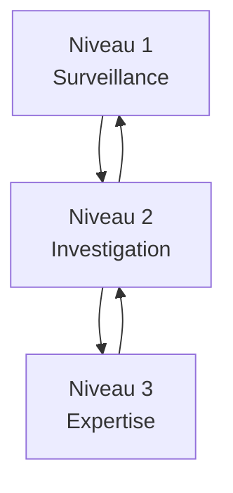

# 🏢 Modèle SOC à 3 niveaux

## 🔐 Qu’est-ce qu’un SOC (Security Operations Center) ?

Un **SOC (Centre des opérations de sécurité)** est une entité chargée de **surveiller, détecter, analyser et répondre** aux incidents de cybersécurité.  
Il est généralement structuré en **trois niveaux** pour optimiser la gestion des alertes et incidents.

---

## 🧱 Structure classique du SOC

### 🧑‍💻 Niveau 1 – Analyste de surveillance (Tier 1)

**Rôle :** Première ligne de défense

- Surveillance en temps réel des alertes SIEM/XDR
- Triage initial : faux positifs / vrais incidents
- Escalade au niveau 2 si nécessaire
- Rédaction des rapports d’incident
- Exécution de procédures standard (playbooks)

**Compétences clés :**
- Connaissance des outils SIEM, EDR
- Réactivité et rigueur
- Compréhension des alertes courantes

---

### 🧠 Niveau 2 – Analyste confirmé / Investigation (Tier 2)

**Rôle :** Analyse approfondie des incidents

- Enquête détaillée sur les incidents escaladés
- Corrélation des événements sur plusieurs sources
- Reconstitution de la chaîne d’attaque
- Définition de la portée de l’impact
- Recommandation de mesures correctives

**Compétences clés :**
- Forensique, analyse réseau, reverse engineering
- Bonne compréhension des APT et techniques MITRE ATT&CK
- Maîtrise des outils d’analyse (Wireshark, Velociraptor...)

---

### 🧑‍🏫 Niveau 3 – Expert / Réponse & Threat Hunting (Tier 3)

**Rôle :** Expertise et amélioration continue

- Threat hunting proactif (recherche de menaces non détectées)
- Création de nouvelles règles de détection
- Automatisation des processus de réponse
- Analyse des attaques avancées (APT, zero-day)
- Contribution à la stratégie de cybersécurité

**Compétences clés :**
- Expertise technique poussée
- Connaissances en développement/script
- Capacités d’analyse stratégique

---

## 🔄 Interactions entre les niveaux

---

## ✅ Avantages du modèle à 3 niveaux

- Répartition claire des rôles et responsabilités
- Rapidité de traitement des incidents
- Meilleure gestion des ressources humaines
- Évolution de carrière structurée pour les analystes

---

## 📚 Bonnes pratiques

- Mettre à jour régulièrement les compétences des analystes
- Mettre en place des playbooks documentés pour chaque niveau
- Favoriser la collaboration entre niveaux (retours d’expérience)
- Automatiser les tâches répétitives de niveau 1 et 2

