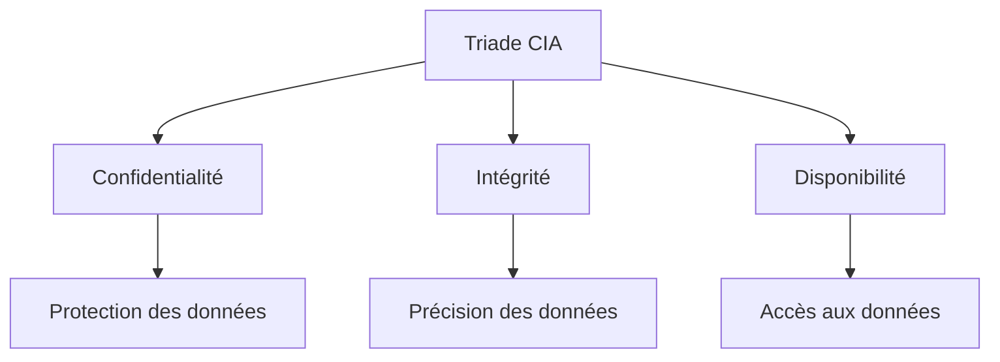
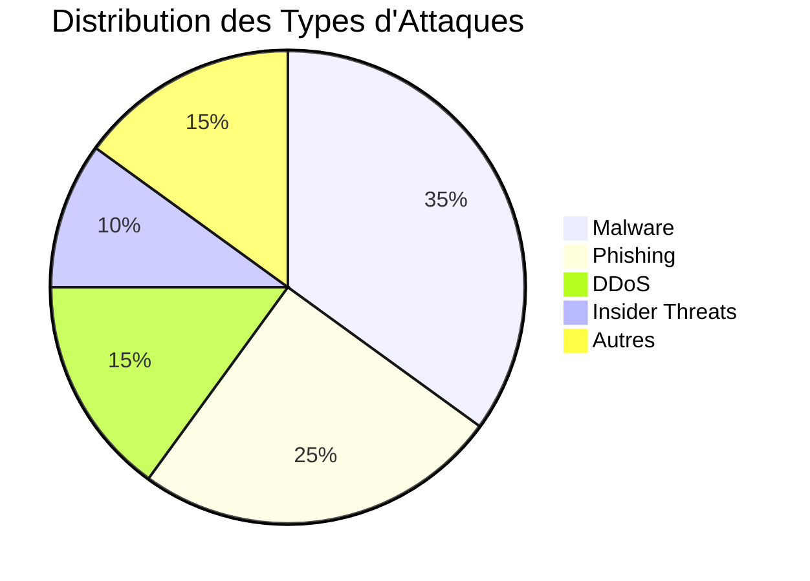

# Introduction à la Cybersécurité

## Qu'est-ce que la Cybersécurité ?

La cybersécurité est l'ensemble des mesures et pratiques visant à protéger les systèmes informatiques, les réseaux et les données contre les accès non autorisés, les attaques et les dommages.

## Concepts Fondamentaux

### La Triade CIA



### Types de Menaces

1. **Malware**
   - Virus
   - Vers
   - Chevaux de Troie
   - Ransomware

2. **Attaques de Réseau**
   - DDoS
   - Man-in-the-Middle
   - Sniffing

3. **Ingénierie Sociale**
   - Phishing
   - Vishing
   - Baiting

## Exemple de Code : Détection de Ports Ouverts

```python
import socket
import threading
from queue import Queue

def scan_port(target, port, open_ports):
    try:
        sock = socket.socket(socket.AF_INET, socket.SOCK_STREAM)
        sock.settimeout(1)
        result = sock.connect_ex((target, port))
        if result == 0:
            open_ports.append(port)
        sock.close()
    except:
        pass

def port_scanner(target, start_port, end_port):
    open_ports = []
    threads = []
    q = Queue()
    
    for port in range(start_port, end_port + 1):
        thread = threading.Thread(target=scan_port, args=(target, port, open_ports))
        threads.append(thread)
        thread.start()
    
    for thread in threads:
        thread.join()
    
    return open_ports

# Exemple d'utilisation
target = "localhost"
start_port = 1
end_port = 1024
open_ports = port_scanner(target, start_port, end_port)
print(f"Ports ouverts sur {target}: {open_ports}")
```

## Quiz de Validation

<!--quiz
question: "Quelle est la signification de CIA dans le contexte de la cybersécurité ?"
options:
  - "Central Intelligence Agency"
  - "Confidentiality, Integrity, Availability"
  - "Computer Information Assurance"
  - "Cyber Information Analysis"
correct_answer: "Confidentiality, Integrity, Availability"
explanation: "La triade CIA représente les trois principes fondamentaux de la sécurité de l'information : Confidentialité, Intégrité et Disponibilité."
-->

<!--quiz
question: "Quel type d'attaque vise à submerger un système avec un trafic excessif ?"
options:
  - "Phishing"
  - "DDoS"
  - "Man-in-the-Middle"
  - "SQL Injection"
correct_answer: "DDoS"
explanation: "Une attaque DDoS (Distributed Denial of Service) vise à rendre un service indisponible en le submergeant de trafic provenant de multiples sources."
-->

## Visualisation : Types d'Attaques



## Meilleures Pratiques

1. **Mise à jour régulière**
   - Systèmes d'exploitation
   - Applications
   - Antivirus

2. **Gestion des mots de passe**
   - Utilisation de mots de passe forts
   - Authentification à deux facteurs
   - Gestionnaire de mots de passe

3. **Sauvegarde des données**
   - Sauvegardes régulières
   - Stockage sécurisé
   - Test de restauration

## Ressources Additionnelles

- [OWASP Top 10](https://owasp.org/www-project-top-ten/)
- [MITRE ATT&CK](https://attack.mitre.org/)
- [NIST Cybersecurity Framework](https://www.nist.gov/cyberframework) 