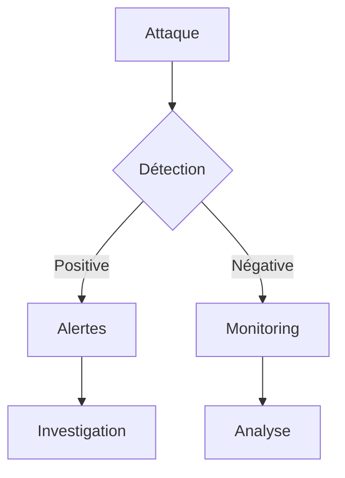

# 📚 Documentation Interactive

## 🎯 Objectif
Rendre la documentation plus interactive et pédagogique en intégrant des éléments dynamiques.

## 💡 Fonctionnalités Proposées

### 1. Diagrammes Interactifs


### 2. Exemples de Code Exécutables
```python
# Exemple de détection d'intrusion
def detect_intrusion(logs):
    alerts = []
    for log in logs:
        if is_suspicious(log):
            alerts.append(create_alert(log))
    return alerts
```

### 3. Quiz de Validation
- Questions à choix multiples
- Exercices pratiques
- Cas d'études interactifs

### 4. Environnements de Test
- Sandbox pour tester les outils
- Labo virtuel pour les exercices
- Scénarios d'attaque simulés

## 🛠️ Implémentation

### 1. Intégration avec Jupyter
- Notebooks interactifs
- Visualisations dynamiques
- Exemples exécutables

### 2. API de Démonstration
- Endpoints de test
- Exemples de requêtes
- Documentation Swagger

### 3. Environnements Docker
- Containers préconfigurés
- Scénarios d'apprentissage
- Outils de test

## 📊 Métriques d'Apprentissage
- Suivi de progression
- Statistiques d'utilisation
- Feedback utilisateur

## 🔄 Mise à Jour Continue
- Contenu dynamique
- Mises à jour automatiques
- Versioning intelligent 