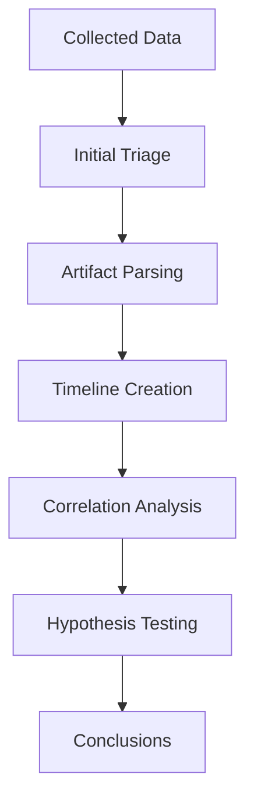
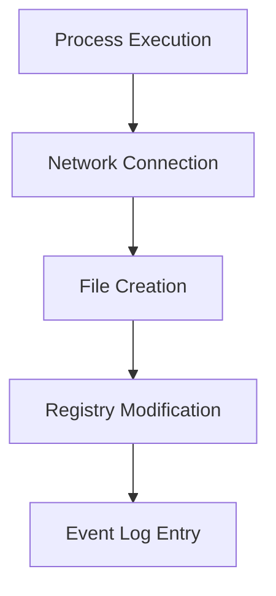

# 🔍 Analysis - Analyse d'Artefacts Forensiques

<div align="center">


*Outils et techniques pour l'analyse approfondie des preuves numériques*

</div>

---

## 📋 Contenu du Dossier

### 🪟 **Windows Artifacts**
- **Registry Analysis** - SYSTEM, SOFTWARE, SAM, NTUSER.DAT
- **Event Logs** - Security, System, Application logs
- **MFT Analysis** - Master File Table examination
- **Prefetch** - Program execution artifacts
- **Jump Lists** - Application usage tracking

### 🧠 **Memory Analysis**
- **Volatility** - Memory forensics framework
- **Rekall** - Advanced memory analysis
- **MemProcFS** - Virtual file system
- **Process Analysis** - Running processes investigation

### 🌐 **Network Forensics**
- **Wireshark Analysis** - Packet examination
- **NetworkMiner** - Network artifact extraction
- **Zeek** - Network security monitoring
- **Traffic Analysis** - Flow and behavior analysis

### ⏰ **Timeline Analysis**
- **Timeline Explorer** - Visualization and filtering
- **Plaso** - Timeline creation
- **Log2timeline** - Multi-source timeline
- **Super Timeline** - Comprehensive reconstruction

---

## 🎯 Méthodologie d'Analyse

### 🔄 **Analysis Process**


### 🎯 **Focus Areas**
1. **System Activity** - What happened?
2. **Timeline** - When did it happen?
3. **Attribution** - Who was involved?
4. **Impact** - What was affected?
5. **Evidence** - How can we prove it?

---

## 🪟 Windows Artifacts Analysis

### 🗂️ **Registry Analysis**
```bash
# Registry Explorer (Eric Zimmerman)
RegistryExplorer.exe --f SYSTEM

# RECmd batch processing
RECmd.exe -d C:\Registry --bn BatchExamples\Kroll_Batch.reb --nl --csv C:\Output

# Specific registry analysis
RECmd.exe -f NTUSER.DAT --kn "Software\Microsoft\Windows\CurrentVersion\Run"
```

### 📊 **Key Registry Locations**
| Hive | Location | Contains |
|------|----------|----------|
| SYSTEM | System configuration | Services, drivers, network |
| SOFTWARE | Installed software | Applications, policies |
| SAM | User accounts | Local users, groups |
| SECURITY | Security policies | Audit settings, LSA secrets |
| NTUSER.DAT | User profile | User settings, recent files |

### 📝 **Event Log Analysis**
```bash
# EvtxECmd (Eric Zimmerman)
EvtxECmd.exe -d C:\Windows\System32\winevt\Logs --csv C:\Output

# Specific event log
EvtxECmd.exe -f Security.evtx --csv C:\Output

# With maps for better parsing
EvtxECmd.exe -f System.evtx --csv C:\Output --inc "Event Log service*"
```

### 🔍 **Critical Event IDs**
| Event ID | Log | Description |
|----------|-----|-------------|
| 4624 | Security | Successful logon |
| 4625 | Security | Failed logon |
| 4648 | Security | Logon with explicit credentials |
| 4688 | Security | Process creation |
| 7045 | System | Service installation |
| 1001 | Application | Application crash |

---

## 🧠 Memory Analysis avec Volatility

### 🚀 **Volatility Setup**
```bash
# Installation
pip install volatility3

# Vérifier le profile
volatility -f memory.raw imageinfo

# Linux alternative
vol.py -f memory.raw linux.banner
```

### 🔍 **Commandes Essentielles**
```bash
# Processus en cours
volatility -f memory.raw --profile=Win10x64_19041 pslist
volatility -f memory.raw --profile=Win10x64_19041 pstree

# Connexions réseau
volatility -f memory.raw --profile=Win10x64_19041 netscan

# DLL et modules
volatility -f memory.raw --profile=Win10x64_19041 dlllist -p PID

# Extraction de processus
volatility -f memory.raw --profile=Win10x64_19041 procdump -p PID -D output/

# Malware hunting
volatility -f memory.raw --profile=Win10x64_19041 malfind
volatility -f memory.raw --profile=Win10x64_19041 hollowfind
```

### 📊 **Analysis Workflow**
1. **Profile identification** - Déterminer l'OS
2. **Process analysis** - Identifier les processus
3. **Network analysis** - Connexions actives
4. **Malware hunting** - Recherche d'anomalies
5. **File extraction** - Extraction d'artefacts

---

## ⏰ Timeline Analysis

### 📈 **Timeline Explorer**
```
1. Ouvrir Timeline Explorer
2. File > Open CSV files
3. Sélectionner les CSV parsés par KAPE
4. Configurer les colonnes
5. Appliquer les filtres
6. Analyser les patterns
```

### 🔍 **Techniques de Filtrage**
- **Date Range** - Période suspecte
- **File Extensions** - Types de fichiers
- **User Activity** - Actions utilisateur
- **System Events** - Événements système
- **Keywords** - Mots-clés suspects

### 📊 **Timeline Sources**
| Source | Information |
|--------|-------------|
| MFT | File creation, modification, access |
| Event Logs | System and security events |
| Registry | Configuration changes |
| Prefetch | Program execution |
| Browser History | Web activity |
| Jump Lists | Recent file access |

---

## 🌐 Network Forensics

### 📡 **Wireshark Analysis**
```bash
# Ouvrir PCAP
wireshark capture.pcap

# Filtres utiles
http.request.method == "POST"    # Requêtes POST
tcp.port == 80 or tcp.port == 443 # Traffic web
ip.addr == 192.168.1.100         # Adresse spécifique
dns                              # Trafic DNS
```

### 🔍 **Indicators of Compromise (IOCs)**
- **Unusual ports** - Communications non standard
- **DNS queries** - Domaines suspects
- **Data exfiltration** - Gros volumes sortants
- **C2 communication** - Patterns réguliers
- **Protocol anomalies** - Protocoles inattendus

---

## 📊 Correlation Techniques

### 🔗 **Cross-Artifact Analysis**


### 🎯 **Correlation Methods**
1. **Temporal** - Même fenêtre temporelle
2. **Process** - Même PID ou nom de processus
3. **User** - Même compte utilisateur
4. **Network** - Même adresse IP
5. **File** - Même nom de fichier

---

## 🛠️ Scripts d'Analyse

### 🐍 **Python - Timeline Correlator**
```python
import pandas as pd
from datetime import datetime, timedelta

def correlate_events(timeline_csv, time_window=300):
    """Correlate events within time window (seconds)"""
    df = pd.read_csv(timeline_csv)
    df['timestamp'] = pd.to_datetime(df['timestamp'])
    
    # Group events by time proximity
    correlations = []
    for index, row in df.iterrows():
        window_start = row['timestamp'] - timedelta(seconds=time_window)
        window_end = row['timestamp'] + timedelta(seconds=time_window)
        
        related_events = df[
            (df['timestamp'] >= window_start) & 
            (df['timestamp'] <= window_end) &
            (df.index != index)
        ]
        
        if not related_events.empty:
            correlations.append({
                'primary_event': row,
                'related_events': related_events
            })
    
    return correlations
```

---

## 📋 Analysis Checklists

### ✅ **Malware Analysis**
- [ ] Unusual process names/paths
- [ ] Network connections to suspicious IPs
- [ ] File modifications in system directories
- [ ] Registry persistence mechanisms
- [ ] Scheduled tasks or services
- [ ] Code injection indicators

### ✅ **User Activity**
- [ ] Login/logout events
- [ ] File access patterns
- [ ] USB device usage
- [ ] Browser activity
- [ ] Email communications
- [ ] Application usage

### ✅ **System Compromise**
- [ ] Privilege escalation attempts
- [ ] Credential dumping indicators
- [ ] Lateral movement evidence
- [ ] Data staging/exfiltration
- [ ] Anti-forensics techniques
- [ ] Persistence mechanisms

---

## 📚 Ressources

- 🎓 **[Volatility Documentation](https://volatility3.readthedocs.io/)** - Memory analysis
- 📖 **[Windows Forensics](https://www.sans.org/posters/windows-forensic-analysis/)** - SANS poster
- 🔧 **[Eric Zimmerman Tools](https://ericzimmerman.github.io/)** - EZ Tools
- 📋 **[DFIR Artifact Museum](https://github.com/AndrewRathbun/DFIRArtifactMuseum)** - Artifacts reference

---

<div align="center">

*🔍 L'analyse méthodique révèle toujours la vérité !*

</div>