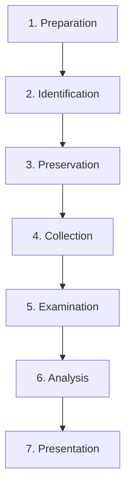

# 🔬 FORENSIC - Digital Forensics & DFIR

<div align="center">


*Arsenal complet pour l'investigation numérique et la réponse aux incidents*

</div>

---

## 📋 Table des Matières

- [🎯 Vue d'Ensemble](#-vue-densemble)
- [🏗️ Structure du Dossier](#️-structure-du-dossier)
- [🚀 Guide de Démarrage](#-guide-de-démarrage)
- [🛠️ Outils par Phase](#️-outils-par-phase)
- [📚 Méthodologies](#-méthodologies)
- [⚡ Quick Start](#-quick-start)

---

## 🎯 Vue d'Ensemble

**DFIR** (Digital Forensics & Incident Response) combine l'investigation numérique et la réponse aux incidents pour identifier, analyser et contenir les menaces cybersécurité. Ce dossier contient tous les outils, techniques et guides nécessaires pour mener des investigations forensiques professionnelles.

### 🌟 Domaines Couverts
- **Collection** - Acquisition d'artefacts et preuves
- **Analysis** - Examen et interprétation des données
- **Timeline** - Reconstruction chronologique
- **Reporting** - Documentation et présentation
- **Tools** - Outils forensiques spécialisés

---

## 🏗️ Structure du Dossier

```
forensic/
├── 📁 01-collection/
│   ├── live-forensics/         # KAPE, Velociraptor
│   ├── disk-imaging/           # FTK Imager, dd
│   ├── memory-capture/         # Volatility, WinPmem
│   └── network-capture/        # Wireshark, tcpdump
├── 📁 02-analysis/
│   ├── windows-artifacts/      # Registry, Event Logs, MFT
│   ├── memory-analysis/        # Volatility, Rekall
│   ├── network-forensics/      # Trafic analysis
│   └── timeline-analysis/      # Timeline Explorer
├── 📁 03-tools/
│   ├── zimmerman-tools/        # EZ Tools suite
│   ├── autopsy/               # Autopsy guides
│   ├── commercial-tools/       # EnCase, FTK
│   └── open-source/           # Open source tools
└── 📁 99-resources/
    ├── cheatsheets/           # Quick reference
    ├── case-studies/          # Real examples
    ├── documentation/         # Manuals, PDFs
    └── templates/             # Report templates
```

---

## 🚀 Guide de Démarrage

### 🔰 Pour les Débutants
1. **Commencez par** `99-resources/` pour comprendre les bases
2. **Apprenez** `01-collection/live-forensics/` avec KAPE
3. **Pratiquez** `02-analysis/timeline-analysis/` avec Timeline Explorer

### 🎯 Pour les Professionnels
1. **Consultez** directement les outils spécialisés
2. **Utilisez** les cheatsheets pour référence rapide
3. **Adaptez** les templates à vos besoins

---

## 🛠️ Outils par Phase

### 🗂️ **Collection**
| Outil | Catégorie | OS | Description |
|-------|-----------|----|--------------|
| KAPE | Live Forensics | Windows | Artifact collection & parsing |
| Velociraptor | Live Forensics | Multi | Endpoint visibility |
| FTK Imager | Disk Imaging | Windows | Disk imaging tool |
| WinPmem | Memory | Windows | Memory acquisition |

### 🔍 **Analysis**
| Outil | Catégorie | Spécialité | Description |
|-------|-----------|------------|-------------|
| Timeline Explorer | Timeline | Analysis | Timeline visualization |
| Registry Explorer | Windows | Registry | Registry analysis |
| Volatility | Memory | Analysis | Memory forensics |
| Autopsy | Platform | Multi | Forensic platform |

### 🛡️ **Zimmerman Tools (EZ Tools)**
| Outil | Function | Usage |
|-------|----------|---------|
| AmcacheParser | Execution | Program execution artifacts |
| EvtxECmd | Logs | Windows Event Log parser |
| JLECmd | Shortcuts | Jump List analysis |
| LECmd | Shortcuts | LNK file analysis |
| RECmd | Registry | Registry analysis |
| ShellBagsExplorer | Activity | User activity |

---

## 📚 Méthodologies

### 🎯 **DFIR Process**


### 🔄 **Investigation Workflow**
1. **Triage** - Évaluation rapide
2. **Collection** - Acquisition d'artefacts
3. **Processing** - Parsing des données
4. **Analysis** - Examen approfondi
5. **Timeline** - Reconstruction chronologique
6. **Reporting** - Documentation des résultats

---

## ⚡ Quick Start

### 🏃 **Investigation Rapide (Triage)**
```bash
# 1. Collection KAPE Basic
kape.exe --tsource C: --tdest C:\KAPE_Output --target !BasicCollection

# 2. Parsing automatique
kape.exe --msource C:\KAPE_Output --mdest C:\KAPE_Parsed --module !EZParser

# 3. Analyse Timeline
# Ouvrir les CSV avec Timeline Explorer
```

### 🔍 **Investigation Complète**
```bash
# 1. Collection complète
kape.exe --tsource C: --tdest C:\KAPE_Output --target !SANS_Triage

# 2. Memory dump
winpmem.exe memory.raw

# 3. Volatility analysis
volatility -f memory.raw --profile=Win10x64 pslist
```

---

## 🏆 Cas d'Usage Courants

### 🦠 **Malware Investigation**
- Collection avec KAPE `!Malware`
- Analyse mémoire Volatility
- Timeline reconstruction
- IOC extraction

### 👤 **Insider Threat**
- User activity analysis
- File access patterns
- Email investigation
- USB usage tracking

### 🌐 **Network Intrusion**
- Network artifacts
- Log correlation
- Timeline analysis
- Attribution research

---

## 📊 Artefacts Windows Clés

### 🗂️ **System Artifacts**
- **Registry** - Configuration système
- **Event Logs** - Activité système
- **MFT** - File system metadata
- **USN Journal** - File changes

### 👤 **User Artifacts**
- **NTUSER.DAT** - User registry
- **Browser History** - Web activity
- **Recent Files** - File access
- **Jumplists** - Application usage

### 📡 **Network Artifacts**
- **Prefetch** - Program execution
- **DNS Cache** - Name resolution
- **Network Connections** - Active connections
- **Firewall Logs** - Network filtering

---

## 📚 Ressources Supplémentaires

- 🎓 **[SANS DFIR](https://www.sans.org/cyber-security-courses/advanced-incident-response-threat-hunting-digital-forensics/)** - Formations
- 📖 **[Eric Zimmerman Blog](https://binaryforay.blogspot.com/)** - EZ Tools updates
- 🔧 **[DFIR Tools](https://www.dfir.training/)** - Training platform
- 📋 **[DFIR Cheat Sheets](https://www.jaiminton.com/cheatsheet/)** - Quick reference
- 🏛️ **[NIST Guidelines](https://csrc.nist.gov/publications/detail/sp/800-86/final)** - Official standards

---

<div align="center">

**💡 Astuce :** Commencez toujours par KAPE pour la collection, puis Timeline Explorer pour l'analyse !

*Dernière mise à jour : Juin 2025*

</div>