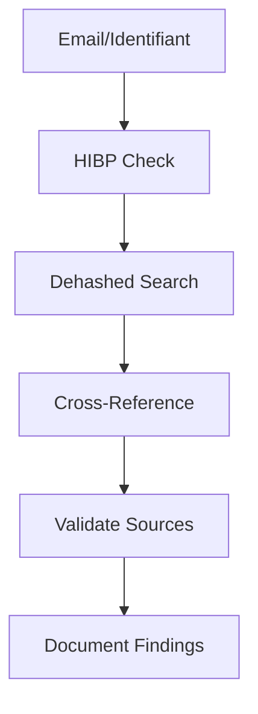

# 📊 Data Sources - Sources de Données OSINT

<div align="center">


*Bases de données et sources d'information pour l'intelligence*

</div>

---

## 📋 Contenu du Dossier

### 💥 **Data Breaches**
- **Have I Been Pwned** - Vérification de fuites de données
- **Dehashed** - Base de données de mots de passe
- **LeakCheck** - Vérification de violations
- **Snusbase** - Recherche dans les fuites

### 🔍 **Intelligence Sources**
- **Intelligence X** - Moteur de recherche OSINT
- **Shodan** - Internet des objets
- **Censys** - Surveillance Internet
- **BinaryEdge** - Cybersecurity search engine

### 🌍 **Geolocation**
- **NASA Worldview** - Imagerie satellite
- **Mapillary** - Images de rue
- **Overpass Turbo** - Données OpenStreetMap
- **Wigle** - Base de données WiFi

---

## 🎯 Types de Données

### 📧 **Données Personnelles**
- Adresses email compromises
- Mots de passe exposés
- Informations de profil
- Données financières

### 🏢 **Données d'Entreprise**
- Informations employés
- Données techniques
- Infrastructure IT
- Communications internes

### 🌐 **Données Techniques**
- Adresses IP
- Certificats SSL
- Ports ouverts
- Vulnérabilités

---

## 🚀 Workflow de Vérification



---

## ⚡ Quick Checks

```bash
# Vérification email
curl "https://haveibeenpwned.com/api/v3/breachedaccount/test@example.com"

# Recherche IP
shodan search "ip:1.2.3.4"

# Géolocalisation IP
curl "http://ip-api.com/json/1.2.3.4"
```

---

## 🔒 Considérations Légales

### ✅ **Autorisé**
- Vérification de ses propres données
- Recherche d'informations publiques
- Investigation défensive
- Recherche académique

### ❌ **Interdit**
- Accès non autorisé
- Usurpation d'identité
- Harcèlement
- Violation de la vie privée

---

## 📚 Ressources

- 🛡️ **[HIBP API](https://haveibeenpwned.com/API/v3)** - Documentation API
- 📖 **[Breach Directory](https://breachdirectory.org/)** - Répertoire de fuites
- 🔍 **[IntelTechniques](https://inteltechniques.com/tools/)** - Outils OSINT

---

<div align="center">

*⚠️ Utilisez ces outils de manière éthique et légale !*

</div>