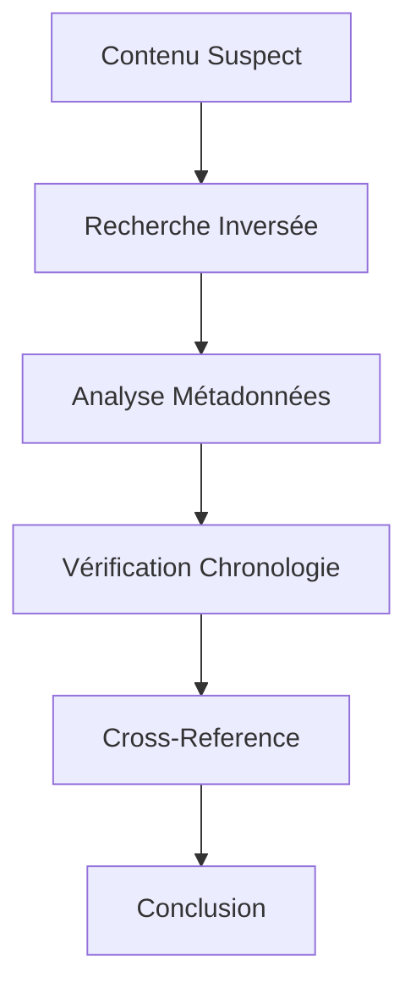

# ✅ Verification - Vérification et Validation

<div align="center">


*Outils pour vérifier l'authenticité et valider les informations*

</div>

---

## 📋 Contenu du Dossier

### 🖼️ **Image Analysis**
- **TinEye** - Recherche d'images inversée
- **Google Images** - Recherche visuelle Google
- **Yandex Images** - Recherche d'images russe
- **Bing Visual Search** - Recherche visuelle Microsoft

### 🎥 **Video Analysis**
- **InVID** - Vérification de vidéos
- **YouTube DataViewer** - Métadonnées YouTube
- **Amnesty Citize Evidence Lab** - Vérification médias
- **FFprobe** - Analyse technique vidéo

### 🎭 **Identity Tools**
- **Fake Person Generator** - Génération d'identités
- **This Person Does Not Exist** - Visages IA
- **Generated Photos** - Photos générées
- **FaceSwapper** - Détection de deepfakes

---

## 🎯 Objectifs de Vérification

### 🔍 **Authenticité**
- Vérifier l'origine d'une image
- Détecter les manipulations
- Identifier les deepfakes
- Valider les métadonnées

### 📅 **Chronologie**
- Dater les contenus
- Vérifier les timestamps
- Identifier les réutilisations
- Tracer l'historique

### 🌍 **Géolocalisation**
- Localiser les prises de vue
- Vérifier les lieux
- Identifier les landmarks
- Valider les coordonnées

---

## 🚀 Workflow de Vérification



---

## ⚡ Techniques Rapides

### 🖼️ **Vérification Image**
```bash
# Métadonnées EXIF
exiftool image.jpg

# Recherche inversée
# Glisser l'image sur TinEye ou Google Images

# Analyse forensique
binwalk image.jpg
```

### 🎥 **Vérification Vidéo**
```bash
# Métadonnées vidéo
ffprobe -v quiet -print_format json -show_format video.mp4

# Extraction frames
ffmpeg -i video.mp4 -vf fps=1/60 frame_%04d.png
```

---

## 🔍 Indicateurs de Manipulation

### 🚨 **Signaux d'Alarme**
- Métadonnées manquantes
- Qualité incohérente
- Éclairage suspect
- Ombres anormales
- Artefacts de compression

### ✅ **Bonnes Pratiques**
- Vérifier plusieurs sources
- Analyser les métadonnées
- Utiliser plusieurs outils
- Documenter le processus
- Conserver les preuves

---

## 🛠️ Outils Recommandés

### 🎯 **Essentiels**
| Outil | Usage | Efficacité |
|-------|-------|------------|
| TinEye | Recherche inversée | ⭐⭐⭐⭐⭐ |
| InVID | Vérification vidéo | ⭐⭐⭐⭐⭐ |
| ExifTool | Métadonnées | ⭐⭐⭐⭐⭐ |
| FotoForensics | Analyse ELA | ⭐⭐⭐⭐ |

---

## 📚 Ressources

- 🎓 **[Bellingcat](https://www.bellingcat.com/)** - Techniques avancées
- 📖 **[First Draft](https://firstdraftnews.org/)** - Vérification médias
- 🔧 **[Amnesty Citize Evidence Lab](https://citizenevidence.org/)** - Outils vérification
- 📚 **[Verification Handbook](http://verificationhandbook.com/)** - Guide complet

---

<div align="center">

*🔍 La vérification est essentielle à l'intelligence fiable !*

</div>