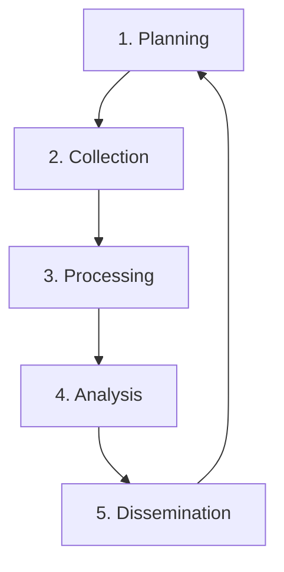

# 🎯 Frameworks - Méthodologies et Cadres OSINT

<div align="center">


*Cadres méthodologiques et frameworks pour structurer l'intelligence*

</div>

---

## 📋 Frameworks Disponibles

### 🌐 **OSINT Framework**
- **Description** : Référence complète des outils OSINT
- **URL** : https://osintframework.com/
- **Usage** : Navigation par catégories d'outils
- **Niveau** : Tous niveaux

### 🔄 **Cycle de Renseignement**
- **Phases** : Planification → Collecte → Traitement → Analyse → Diffusion
- **Standard** : Méthode militaire adaptée OSINT
- **Avantages** : Structure méthodique
- **Applications** : Investigations complètes

### 🎯 **PINT Framework**
- **P**eople - Personnes
- **I**nfrastructure - Infrastructure
- **N**etwork - Réseau
- **T**echnology - Technologie

### 🔍 **SOCMINT**
- **Definition** : Social Media Intelligence
- **Focus** : Réseaux sociaux exclusivement
- **Techniques** : Analyse comportementale
- **Applications** : Profiling, tendances

---

## 🎯 Méthodologies Standard

### 📊 **Intelligence Cycle**


### 🔍 **OSINT Process**
1. **Requirement** - Définir les besoins
2. **Source Identification** - Identifier les sources
3. **Data Collection** - Collecter les données
4. **Processing** - Traiter l'information
5. **Analysis** - Analyser et interpréter
6. **Production** - Produire l'intelligence
7. **Dissemination** - Diffuser les résultats

---

## 🛠️ Outils de Framework

### 🌐 **Platforms Intégrées**
- **Maltego** - Visualisation des liens
- **SpiderFoot** - Reconnaissance automatisée
- **MISP** - Partage d'intelligence
- **OpenCTI** - Plateforme threat intelligence

### 📊 **Templates et Guides**
- **Requirements Template** - Définition des besoins
- **Collection Plan** - Plan de collecte
- **Analysis Worksheet** - Feuille d'analyse
- **Report Template** - Modèle de rapport

---

## 🎯 Modèles d'Investigation

### 👤 **Person Investigation**
```
1. Basic Information
   ├── Name, Age, Location
   ├── Contact Information
   └── Family/Associates

2. Digital Footprint
   ├── Social Media Profiles
   ├── Online Activities
   └── Professional Networks

3. Verification
   ├── Cross-Reference Sources
   ├── Validate Information
   └── Document Findings
```

### 🏢 **Company Investigation**
```
1. Corporate Structure
   ├── Legal Information
   ├── Ownership Details
   └── Subsidiaries

2. Digital Assets
   ├── Domains/Subdomains
   ├── IP Ranges
   └── Technical Infrastructure

3. Personnel
   ├── Key Employees
   ├── Organizational Chart
   └── Contact Information
```

---

## 📋 Checklists Standards

### ✅ **Pre-Investigation**
- [ ] Objectifs définis
- [ ] Limites légales comprises
- [ ] Outils préparés
- [ ] Documentation prête

### ✅ **During Investigation**
- [ ] Sources documentées
- [ ] Timestamps enregistrés
- [ ] Screenshots sauvegardés
- [ ] Liens conservés

### ✅ **Post-Investigation**
- [ ] Résultats vérifiés
- [ ] Rapport rédigé
- [ ] Preuves archivées
- [ ] Leçons apprises

---

## 📚 Standards et Certifications

### 🎓 **Certifications OSINT**
- **SANS FOR578** - Cyber Threat Intelligence
- **OSINT Combine** - Maltego Training
- **Bellingcat** - Online Investigation
- **i-intelligence** - OSINT Professional

### 📖 **Standards Industrie**
- **STIX/TAXII** - Structured Threat Information
- **MITRE ATT&CK** - Adversary Tactics
- **TLP** - Traffic Light Protocol
- **FIRST** - Forum of Incident Response

---

## 🔧 Outils de Productivité

### 📝 **Documentation**
- **Obsidian** - Prise de notes liées
- **Notion** - Workspace collaboratif
- **Joplin** - Notes sécurisées
- **CherryTree** - Arbre de notes

### 📊 **Visualisation**
- **Maltego** - Link analysis
- **Gephi** - Network visualization
- **Cytoscape** - Complex networks
- **yEd** - Graph editing

---

## 📚 Ressources Complémentaires

- 🎯 **[OSINT Framework](https://osintframework.com/)** - Référence complète
- 📖 **[OSINT Handbook](https://i-intelligence.eu/uploads/public-documents/OSINT_Handbook_2020.pdf)** - Guide officiel
- 🎓 **[Intel Techniques](https://inteltechniques.com/)** - Formations
- 🔧 **[Awesome OSINT](https://github.com/jivoi/awesome-osint)** - Liste d'outils

---

<div align="center">

*🎯 Un bon framework est la clé d'une investigation réussie !*

</div>